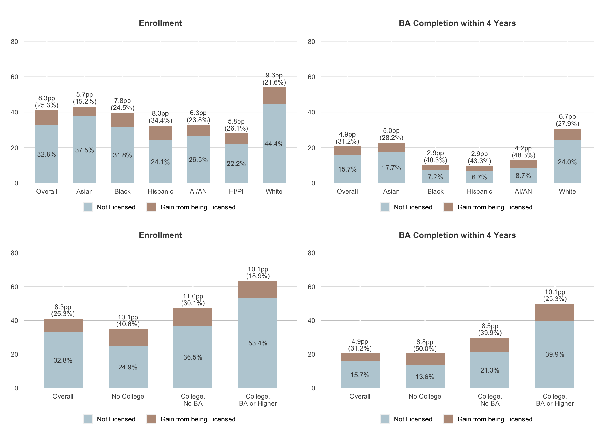

# CB Search and student outcomes
## Howell, Hurwitz, Mabel, et al. (2021)

---

# How could lists be so important?
## The US market for higher education

Title IV institutions
- Allowed to enroll students that receive federal financial aid

 

A national voucher system
- Federal/state student aid, household savings follow students to institutions

 

Tuition is largest revenue source
- Title IV institutions have incentive to enroll students who receive federal student aid

 

Problems
- Students don't know all their options, don't know which institutions interested in them
- Institutions don't know who the prospects are or how to contact them

 

Student lists
- A matchmaking intermediary that connects institutions to prospects

--- .subsection

# The student list project

--- 

# The student list project
## Project overview

Data collection

- Issued public records requests to all public universities in four states (CA, IL, MN, TX)
- Target student list vendors
  - College Board, ACT
- Data collection began February 2020  
  - Seeking student lists purchased from 2016-2020

 
For each purchased list, sought two pieces of data

1. "Order summary" specifying search filter criteria ([LINK](https://drive.google.com/file/d/1gPZ-WWw0gdFT7VtzBN3hKLnj2DzoaqnY/view))
1. De-identified prospect-level student list ([LINK](https://drive.google.com/file/d/1Qvc_QRi9izEF1W78Lh4nNi5NsXjCZqUE/view))

 
Empirical research questions

1. Which filter criteria were selected in student lists purchases?
1. What are the characteristics of prospects included in student lists purchases?
1. What is the relationship between student list filter criteria and the characteristics of
purchased prospects?

 
Partners

- Funded by Joyce Foundation, Kresge Foundation
- Pro bono partnership with a civil rights legal organization and four multinational law firms
- Our first report to be published by [ACCEPT](https://www.acceptgroup.org/)

---

# The student list project
## What we learned

Began the project with a focus on university behavior

- Which universities doing a "good" vs. "bad" job of reaching out to the community?
- This was the wrong focus!

 
What we learned
- The student list products themselves are problematic
- Often, name buys outsourced to consultancy and university employees lacked knowledge
- Radical transformation in market for student list data happening right now
  - For-profit suppliers entered the market
  - Distinction between consulting firms and student list vendor has blurred
  - Test-optional

 
Revised focus
- Student list products
- Dynamics and key players in the market for student list data

--- .section

# The Student List Business

--- .subsection

# Student list basics

--- .subsubsection

# Situating the student list business
## How industries find customers

**Lead generation**

- Connect consumers interested in products (leads) to merchants who sell those products (Federal Trade Commission, 2016)

 
__List-based leads__, based on the direct mail model

- "Publisher" obtains information about customers >>
  - Often, publisher sells data to "aggregator" >>
  - Publisher/aggregator sells data to merchant >>
  - Merchant serves marketing material to consumers via purchased contact info
- Student lists are example of list-based lead generation

 
__Behavioral-based leads__ (e.g., Google Search)

- Target (*verb*) users of a platform (e.g., Twitter)
- Identify targets (*noun*) based on user profile, simultaneously serve ads while they are on platform
  - Also, serve ads when they visit website that partners with the platform (e.g., Google Display Network)

 
Finding customers in higher education

- Buy lists from College Board and ACT to identify college-bound high school students (EAB, 2018)
- Behavioral based marketing to target markets where reliable student lists are unavailable
  - e.g., community college and for-profit credentials, online program managers (OPMs) recruiting adults
  - Additionally, behavioral based marketing for brand awareness

--- &twocol .subsubsection

# Situating the student list business
## The enrollment funnel

*** =left

**The marketing funnel**

 

Source: [skyword.com](https://www.skyword.com/contentstandard/how-the-marketing-funnel-works-from-top-to-bottom/)

*** =right

**The enrollment funnel**

 

Source: [pngwing.com](https://www.pngwing.com/en/free-png-krrpy)

--- &twocol .subsubsection

# Situating the student list business
## The enrollment funnel

*** =left

Prospects

- Population of desirable potential students

Leads

- Prospects whose contact info has been obtained

Inquiries

- Prospects who have contacted the institution
  - Institution as first contact (leads)
  - Student as first contact

 
Interventions along the funnel

- Convert prospects to leads
  - purchase student lists
- Convert leads/inquiries to applicants
  - Email, mail, targeted social media
- Convert admits to enrolles
  - Financial aid packages

*** =right

**The enrollment funnel**

 

Source: [pngwing.com](https://www.pngwing.com/en/free-png-krrpy)

--- .subsubsection

# College Board and ACT lists
## Data sources and list contents

College Board and ACT have been largest student list vendors for several decades

- College Board "Student Search Service" created in 1972 (Belkin, 2019)
- ACT "Educational Opportunity Service"
  - ACT acquired National Research Center for College and University (NRCCUA) in 2018
  - Student list products part of new "Encoura Data Lab"

 
Source of student list data

- Create student list data from database of test takers (e.g., PSAT, SAT, AP, PreACT, ACT)
  - Pre-test questionnaire (e.g., demographic, preferences about college)
- Students have opportunity to opt in or opt out of student list products

 
Pricing

- Historically, a price-per-prospect model
- ACT moved to subscription pricing with [creation of Encoura](https://encoura.org/combined-data-set/)
- College Board currently charges \$0.50 per name, but [moving to subscription pricing](https://cbsearch.collegeboard.org/pdf/2022-23-subscription-plan-pricing.pdf) too

 
What information does a list contain
- Contact, demographic, college preferences, limited academic achievement
- College Board template [HERE](https://drive.google.com/file/d/1Qvc_QRi9izEF1W78Lh4nNi5NsXjCZqUE/view)
- ACT template [HERE](https://drive.google.com/file/d/1rsP45OyOsnPYhV8uWYKDAy_spGhjj6aj/view)

--- .subsubsection

# College Board and ACT lists
## Sources of exclusion

 

College Board and ACT student lists exclude students in two broad ways

1. Generally, only test-takers are included in student list products
  - Test-taking rates differ by race, socioeconomic status, geography
1. "Search filters" allow universities to control which prospects included/excluded from a purchase
  - Relationship between search filters and prospect characteristics is focus of our empirical analyses (report 2)

 
Test-optional

- Test-optional movement threatens "coverage" of College Board/ACT student list products
- Number of test-takers will likely decline in future

--- .subsubsection

# College Board and ACT lists
## Buying student lists

"Search filters" allow universities to control which prospects included/excluded from a purchase

 
Commonly used search filters ([Link to ACT filters](https://helpcenter.encoura.org/hc/en-us/articles/360035260452-Prospect-Search-Filters-))

- Graduation year, HS GPA, test score range, gender, race/ethnicity, geography (e.g., state, zip-code, "geomarket"), intended major

 

New filters based on predictive analytics to facilitate micro-targeting ("efficient" name buys of "right fit" students)

- College Board "geodemographic" filters
  - Target prospects based on historical college-going behavior of students at the school/neighborhood
- ACT "enrollment predictor"
  - Target prospects based on their predicted probability of enrolling at your institution

 

Policy concerns

- Some search filters disproportionately exclude underrepresented students, especially when used in combination
- Filtering prospects based on the behavior of others (e.g., geodemographic filters)
- More broadly, demand for filters that aid "efficient" name buys is a consequence of names costing so much

--- .subsection

# Market dynamics

--- 

# Five dynamics shaping the market for student list data
## &nbsp;

1. **Universities and enrollment management consulting firms**
  - Universities are primary customers of student lists, but EM consultancies play central role in buying and using names
     
1. **New data sources, new vendors**
  - Advances in technology created new sources of student list data, leading to market entry by new vendors
     
1. **Acquisitions and concentration**
  - Trend towards competition reversed by rise in acquisitions; EAB enters the student list business
     
1. **Incumbents College Board and ACT seek to retain competitive advantage**
  - Add product features that aid micro-targeting
  - Enter the market for enrollment management consulting
     
1. **The test-optional movement**
  - For-profit firms poised to acquire market share ceded by CB/ACT, and maximize profit by restricting access to names

--- .subsubsection

# Universities and consulting firms
## &nbsp;

Universities need students

- Universities are the primary customers of student list products
- As recruiting became more complex and competitive, universities hire EM consultancies to develop/implement recruiting campaigns

 
Enrollment management (EM) consulting firms
- Universities are the primary customers of EM consultancies
- EM firms depend on student list suppliers for two reasons:
  1. Advice/execution of name buys is a core service offered by firms
  1. Names are essential input to predictive models and recruiting interventions firms provide

 
Competition in the enrollment management consulting industry

- A mix of large full-service providers (e.g., [Ruffalo Noel Levitz](https://www.ruffalonl.com/)) and small/medium boutique firms (e.g., [Fire Engine Red](https://www.fire-engine-red.com/))
- Anecdotally, market entry in the 2000s
- Over last decade, increase in market concentration due to acquisitions (Rogers, 2014; Wan, 2021)

--- .subsubsection

# New data sources, new vendors
## &nbsp;

Sources of student list data by late 20th Century

- Standardized assessments
- High school students complete paper survey at school (e.g., College Bound Selection Service (CBSS))

 

Advances in technology yield new sources of student list data in the 21st Century

- Data students voluntarily submit online
  - Free college/scholarship search engines (e.g., [scholarships.com](https://www.scholarships.com/), [Niche](https://www.niche.com/colleges/search/best-colleges/), [parchment](https://www.parchment.com/c/college/search/browse/), [Cappex](https://www.cappex.com/))
  - Social network platforms with explicit goal of sharing student profiles with universities they are interested in (e.g., Zinch, [Cirkled In](https://www.cirkledin.com/))
- Software purchased by high schools to help students plan for college
  - e.g., [Naviance](https://www.powerschool.com/solutions/naviance-by-powerschool/), [Scoir](https://www.scoir.com/?hsLang=en-us)
  
 

New data sources create opportunities for market entry by new vendors

- Vendors associated with college search engines (e.g., [Cappex](https://www.cappex.com/))
  - Failed market entry by Chegg
- Vendors associated with software used by high schools/students
  - Hobsons acquired Naviance >> PowerSchool acquired Naviance

--- .subsubsection

# Acquisitions and concentration
## Trends in broader EdTech sector

The 2000s were a time of investment and market entry in EdTech, including:

- Entry in enrollment management consulting industry
- Entry by new student list vendors

 
In last five years, increase in both investment and acquisitions (Bradley, 2021)

- Broader EdTech sector becomes more concentrated
- Student list vendors get acquired (e.g., NRCCUA by ACT, Cappex by EAB)
- Enrollment management consulting firms get acquired (e.g., Noel Levitz by Ruffalo, ) (Rogers, 2014)

 
Emergence of large organizations that are simultaneously consultants, software providers, and suppliers of names

- [EAB](https://eab.com/) is an enrollment management consulting firm
  - EAB does not sell lists the way College Board and ACT do
  - By end of 2021, EAB arguably became one of most important suppliers of names

--- .subsubsection

# Acquisitions and concentration
## EAB enters the student list business

Origins of EAB

- In 1983, Bill Royall founded Royall \& Company to provide direct marketing and fundraising for political campaigns
- By 1995, enrollment management consulting for higher ed became main focus
- In 2015, Royall \& Company was acquired for \$850 million by the the Advisory Board Company (NASDAQ:ABCO)
- In 2017, purchased by Vista Equity partners for \$1.5 billion

--- .subsubsection

# Incumbents seek advantage
## &nbsp;

TEXT

--- .subsubsection

# Test-optional
## &nbsp;

TEXT

--- .section

# Empirical Analyses

--- .subsubsection

# Title
## Subtitle

- Lorem ipsum dolor sit amet, consectetur adipiscing elit. Donec ullamcorper, ex nec aliquet interdum, lorem enim volutpat nisl, at tempus metus mauris ac lectus. Donec in condimentum ligula.
- Vivamus fringilla orci vel varius hendrerit. 
- Cras vehicula pellentesque porttitor. Nulla eros dui, hendrerit at facilisis eu, finibus eget sem. Proin at tristique sapien. 
- Curabitur at nulla et leo pretium vestibulum. Cras ac leo pharetra, faucibus dui et, laoreet neque.

--- .section

# Policy

--- .subsubsection

# Title
## Subtitle

- Lorem ipsum dolor sit amet, consectetur adipiscing elit. Donec ullamcorper, ex nec aliquet interdum, lorem enim volutpat nisl, at tempus metus mauris ac lectus. Donec in condimentum ligula.
- Vivamus fringilla orci vel varius hendrerit. 
- Cras vehicula pellentesque porttitor. Nulla eros dui, hendrerit at facilisis eu, finibus eget sem. Proin at tristique sapien. 
- Curabitur at nulla et leo pretium vestibulum. Cras ac leo pharetra, faucibus dui et, laoreet neque.

--- #references

# References
## &nbsp;

<a href="#cite-belkin2019-studata">[1]</a><cite>
D. Belkin.
&ldquo;For sale: SAT-Takers' names. Colleges buy student data and boost exclusivity&rdquo;.
In: <em>The Wall Street Journal</em> (Nov. 2019).
URL: <a href="https://www.wsj.com/articles/for-sale-sat-takers-names-colleges-buy-student-data-and-boost-exclusivity-11572976621">https://www.wsj.com/articles/for-sale-sat-takers-names-colleges-buy-student-data-and-boost-exclusivity-11572976621</a>.</cite>

<a href="#cite-RN4728">[2]</a><cite>
EAB.
<em>Making your digital ads count: 15 lessons on new and emerging techniques in undergraduate recruitment marketing</em>.
Tech. rep.
EAB, 2018.</cite>

<a href="#cite-ftc2016">[3]</a><cite>
Federal Trade Commission.
<em>Follow the lead workshop</em>.
Tech. rep.
Federal Trade Commission, Dec. 2016.</cite>

<a href="#cite-RN4324">[4]</a><cite>
M. M. Holland.
<em>Divergent paths to college: Race, class, and inequality in high schools</em>.
Rutgers University Press, 2019.
DOI: <a href="https://doi.org/10.36019/9780813590288">10.36019/9780813590288</a>.</cite>

<a href="#cite-RN2771">[5]</a><cite>
D. Hossler and J. P. Bean.
<em>The strategic management of college enrollments</em>.
Jossey-Bass higher education series.
Jossey-Bass, 1990, p. xxii, 330 p.
ISBN: 1555422926.</cite>

<a href="#cite-RN4739">[6]</a><cite>
J. Howell, M. H. Hurwitz, Z. Mabel, et al.
<em>Participation in student search service is associated with higher college enrollment and completion</em>.
Tech. rep.
College Board, 2021.
URL: <a href="https://cbsearch.collegeboard.org/pdf/college-outreach-and-student-outcomes.pdf">https://cbsearch.collegeboard.org/pdf/college-outreach-and-student-outcomes.pdf</a>.</cite>

<a href="#cite-rogers_2014">[7]</a><cite>
G. Rogers.
<em>Are we seeing an edu &quot;vendor shakeout&quot;?</em>
Dec. 2014.
URL: <a href="https://www.linkedin.com/pulse/we-seeking-edu-vendor-shakeout-gil-rogers?trk=mp-reader-card">https://www.linkedin.com/pulse/we-seeking-edu-vendor-shakeout-gil-rogers?trk=mp-reader-card</a>.</cite>

<a href="#cite-wan_2021">[8]</a><cite>
T. Wan.
<em>Hobsons' higher ed business split and sold in separate deals totaling $410m </em>.
Feb. 2021.
URL: <a href="https://www.edsurge.com/news/2021-02-20-hobsons-higher-ed-business-split-and-sold-in-separate-deals-totaling-410m">https://www.edsurge.com/news/2021-02-20-hobsons-higher-ed-business-split-and-sold-in-separate-deals-totaling-410m</a>.</cite>

