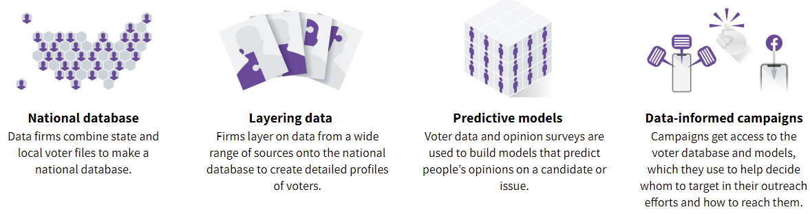

```{r, include = FALSE, eval = FALSE}
# filepath location of apa.csl file and location of .bib list of references
getwd()
list.files(path = file.path('.','..','assets','bib')) # apa.csl file
list.files(path = file.path('.','..','..','..','Google Drive','student_list_brief','literature')) # .bib reference list on Google Drive
```


```{r setup, include = FALSE}
library(knitr)
library(bookdown)

# https://cran.r-project.org/web/packages/kableExtra/vignettes/awesome_table_in_pdf.pdf
library(kableExtra)
library(tidyverse)
library(gridExtra)
library(scales)

knitr::opts_chunk$set(echo = F, message = F, warning = F)

knitr::knit_hooks$set(inline = function(x) {   if(!is.numeric(x)){     x   }else{    prettyNum(round(x,2), big.mark=",")    } })

theme_set(
  theme(
    text = element_text(size = 7),
    panel.background = element_blank(),
    plot.title = element_text(color = '#444444', size = 7, hjust = 0.5, face = 'bold'),
    axis.ticks = element_blank(),
    axis.title = element_text(face = 'bold'),
    legend.title = element_text(face = 'bold'),
    legend.key.size = unit(0.3, 'cm')
  )
)
```

# Executive Summary

TBD

<!-- 
TEXT TO INCLUDE SOMEWHERE
What should the student list business look like, from an equality of opportunity perspective? All talented, hard-working students should have the opportunity to attend a high-quality college or university, regardless of where they live and which school they attend. 

Unfortunately, the actual student list business strays from ideal because it is a lucrative business run by an oligopoly and oriented towards the enrollment goals of universities rather than equality of opportunity for students.
-->


# Introduction
<!-- 
ADJECTIVES
  adversarial; uncooperative; obstructive; antagonistic; stonewall 
  
  
WHERE DOES THIS TEXT GO? USED TO GO IN THE "EFFICIENCY" PART AT THE END OF THE STUDENT LIST BASICS PART; IT IS AN IMPORTANT IDEA THAT NEEDS TO GO SOMEWHERE

In off-the record conversations, enrollment management consultants told us that at the name-buying stage, a university cannot afford to purchase all names, but very little is known about which prospects will be interested in the institution. Therefore, the institution makes purchase decisions based on crude criteria, such as the characteristics of their neighborhood or school.
-->
On February 21, 2020, represented by counsel, we issued a public records request to a public research university (herein "Stonewall University") seeking information about "student list" purchases. Student lists contain the contact information of prospective students that meet the criteria (e.g., test score range, zip codes) specified in an order. Sometimes referred to as "names," student lists are the fundamental input for recruiting campaigns, which target individual prospects by mail, email, and on social media. Our records request sought (A) "order summary" -- which lists the criteria specified -- and (B) de-identified student list data for each student list purchase made by the university over the prior four years.

On April 27, 2020, Stonewall University responded to our request, "The university has a substantial and proprietary interest in maintaining the confidentiality of the documents you have requested. Accordingly, with the exception of the attached slide, the records requested will not be produced." The slide, titled "2016-2020 Name Purchases by Source," indicated that Stonewall University purchased about 816,000 names in 2016, including about 517,000 from College Board and 246,000 from ACT. In 2020, Stonewall University purchased about 1,251,000 names, including about 648,000 from College Board and 220,000 from ACT.

Curiously, the footer of the attached slide read "\copyright EAB Global, Inc." We learned that EAB, an education consulting firm known for enrollment management, purchases student lists on behalf of Stonewall University. This became a barrier to our records request. Stonewall University General Counsel stated, on 12/7/2020, that "while [Stonewall University] indeed purchases student lists, the University does not actually have physical possession of such lists" and, on 1/27/2021, that "this is because [Stonewall University] does not receive anything directly from College Board or from ACT or other list sources. Rather, EAB, on [Stonewall's] behalf, places the order, receives the data, and then [Stonewall University] is billed directly for it." Later, we asked Stonewall University to ask EAB to produce the records but we were told on 8/13/2021 that "EAB also doesn't have or keep these materials." As of December 2021 -- following 22 months of emails, conference calls, and officious letters on firm letterhead -- we have not received the requested order summaries or student lists. An interesting aside, the Vice President for Enrollment Management came to Stonewall University after working as an enrollment consultant for EAB. 

<!--
Q: Does this make pseudonym useless if we say VP came to Stonewall U? Maybe people could figure out who they are based on this sentence?
-->

Our request to Stonewall University is part of a larger project -- funded by the _Joyce Foundation_ and the _Kresge Foundation_ and in partnership with the _Lawyers' Committee for Civil Rights_ and the pro bono offices of four law firms -- that issued public records requests to 93 universities in five states in order to collect quantifiable data about student list purchases (and also off-campus recruiting visits). Each request is a protracted negotiation, often involving several negotiations.

<!--
12 IL
12 MN
32 CA
35 TX
2 AZ
-->

We began this project on the heels of a project that used web-scraping and public records requests to collect data about off-campus recruiting visits made by public research universities [@han2019recruiting]. Most universities in our sample made fewer in-state than out-of-state visits and these out-of-state visits focused on affluent, predominantly White high schools, but a few universities did a "good" job of visiting schools across their state and without evidence of racial or socioeconomic bias. We initially approached the student list data collection with a similar focus on identifying which universities do a "good" vs. "bad" job of reaching out to their surrounding community. However, we made two realizations that helped us see that the focus should be on the student list products themselves and on the organizations that sell student list data.

First, while universities choose which names to purchase, these choices are structured by what the product allows. Moving beyond choices by individual universities, systematic inequality in purchased versus excluded names is a function of (A) which prospective students are included in the underlying database and (B) the set of filters that customers (universities) can utilize to select prospects. The dominant vendors of student list data are the testing organizations, College Board and ACT. Prospective students who do not take College Board or ACT assessments are excluded from the underlying student list databases. Filters on College Board and ACT student list products encourage customers to purchase prospects based on their score range in a particular assessment. Our data collection yielded many student list purchases that filtered prospects based on achieving some score on some set of AP exams. But which students attend high schools with widespread access to AP classes? Geographic filters additionally enable customers to filter prospects based on state, county, metropolitan area, zip code. A more recent creation is filters that enable customers to select prospects based on the characteristics of their high school or their neighborhood (e.g., how many students from this school attended an out-of-state university).
<!-- 
First, once we started analyzing the data, we observed that inequality in purchased vs. excluded names is a function of (A) who is included in the underlying database the student list product pulls from and (B) the set of filters that customers (universities) can utilize to select prospects. 

Yes, universities can choose which filters to apply, but these choices are structured by what the product allows.

Consider the concerns about racial and socioeconomic bias in these assessments and in who takes these assessments. 
-->

<!-- 
TODO: 

[NEED A TOPIC SENTENCE THAT SAYS WHAT THIS REALIZATION IS; RIGHT NOW IT IS SORT OF TWO DIFFERENT OBSERVATIONS; IS IT SOMETHING LIKE FOR-PROFIT ENTITIES HAVE BECOME BIG PLAYERS IN THE STUDENT LIST BUSINESS?] 
-->
Second, over the course of the data collection we noticed that many universities outsourced student list purchases to an enrollment management consulting firm. Our records requests tended to be less successful in these cases. Following our experience with Stonewall University, we initially suspected that universities were using consulting firms as a wedge to withhold data. Over time, we realized that many universities simply did not understand what we were asking for because they had not purchased the lists themselves. EAB, an organization previously unknown to us, was the name that popped up most often, so we decided to learn more. 

<!-- 
TODO:  

Royall & Company did not sign its first university client until 19XX, but by 1995 universities became the primary focus.
-->
The EAB origin story begins in 1983, when Bill Royall founded Royall & Company to provide direct marketing and fundraising for political campaigns. Royall & Company did not sign its first university client until years later, but by 1995 universities became the primary focus. In 2015, the Advisory Board Company acquired Royall & Company for \$850 million [@AdvisoryBoardCo2014]. In 2017, Vista Equity Partners acquired the Royall & Company business for \$1.5 billion and renamed it EAB. Under Vista Equity Partners, EAB has utilized acquisitions (e.g., Cappex college search engines) and alliances (e.g., Naviance software used by high school students) to become a substantial supplier of student list data. Like College Board and ACT, EAB controls proprietary student list data. But whereas any university can buy names from College Board and ACT, only EAB clients have access to the names controlled by EAB.

## The Effects of Student Lists

<!-- https://cbsearch.collegeboard.org/pdf/college-outreach-and-student-outcomes.pdf -->

What is the effect of student lists on college access outcomes for students? @RN4739 analyzed the college access outcomes of SAT test-takers who graduated from high school between 2015-2018. When registering for any College Board exam, students are given the opportunity to opt-in to the College Board Student Search Service, which enables universities to purchase their contact information. @RN4739 merged the database of SAT test-takers to college enrollment data from the National Student Clearinghouse in order to assess whether the college access outcomes of students who opted in to Student Search differed from those who opted out, controlling for covariates such as gender/sex, race/ethnicity, parental education, SAT score, and the high school they attended, among other factors. 

As seen in Figure \@ref(fig:cb-fig-1), after controlling for covariates, 58.0\% of students who participated in Search attended any college compared to 50.2\% of students who opted out of Search, representing a 15.5\% relative increase in the probability of college enrollment ((58.0-50.2)/50.2=15.5). Figure \@ref(fig:cb-fig-2-3) shows that 41.1\% of students who participated in Search attended a 4-year college compared to 32.8\% of students who opted out, representing a 25.3\% relative increase in the probability of attending a 4-year college. Furthermore, change in the relative probability of attending a four-year college associated with opting in to Search was higher for students who identified as Black (24.5%), Hispanic (34.4%), American Indian or Alaska Native (AI/AN) (23.8%), and Native Hawaiian or Pacific Islander (26.1\%) than it was for students who identified as White (21.6\%) or Asian (15.2\%). Similarly, change in the relative probability of attending a four-year college was higher for students whose parents did not attend college (40.6\%), and students whose parents had some college but no BA (30.1\%), than it was for students whose parents had a BA (18.9\%).

```{r cb-fig-1, fig.height = 2.8, fig.width = 4, out.width = '85%', fig.cap = 'Student Search Service and college enrollment and degree completion'}
create_cb_figure <- function(categories, values, plot_title) {
  cb_fig_df <- data.frame(
    category = rep(categories, each = 2),
    subcategory = rep(c('Not Licensed', 'Gain from being Licensed'), length(categories)), 
    value = values
  )
  
  cb_fig_df$category <- factor(cb_fig_df$category, levels = categories)
  
  cb_fig_df %>%
    left_join(
      cb_fig_df %>%
        pivot_wider(id_cols = category, names_from = subcategory, values_from = value) %>%
        mutate(
          total = `Not Licensed` + `Gain from being Licensed`,
          pct_change = `Gain from being Licensed` / `Not Licensed` * 100
        ),
      by = 'category') %>% 
    ggplot(aes(x = category, y = value, fill = subcategory, width = 0.6)) +
    geom_bar(position = 'stack', stat = 'identity') +
    geom_text(aes(y = value, label = if_else(subcategory == 'Not Licensed', str_c(sprintf('%.1f', value), '%'), '')), color = '#444444', size = 2, position = position_stack(vjust = 0.5)) +
    geom_text(aes(y = total + 3, label = if_else(subcategory == 'Not Licensed', str_c('(', sprintf('%.1f', pct_change), '%)'), '')), color = '#444444', size = 2) +
    geom_text(aes(y = total + 7, label = if_else(subcategory == 'Not Licensed', str_c(sprintf('%.1f', `Gain from being Licensed`), 'pp'), '')), color = '#444444', size = 2) +
    ggtitle(plot_title) +
    xlab('') + ylab('') + 
    scale_y_continuous(expand = expansion(mult = c(0, 0.05)), limits = c(0, 80)) +
    scale_fill_manual(values = c('#ba9a88', '#bbcfd7')) +
    theme(
        plot.margin = margin(t = 0.6, unit = 'cm'),
        panel.grid.major.y = element_line(size = 0.1, color = 'gray'),
        legend.title = element_blank(),
        legend.position = 'bottom',
        legend.margin = margin(t = -0.5, unit = 'cm'),
        legend.text = element_text(margin = margin(r = 0.2, unit = 'cm'))
      ) +
      guides(fill = guide_legend(reverse = T))
}

create_cb_figure(
    c('Any College\nEnrollment', '4-Year\nEnrollment', 'Any College\nDegree\nw/in 4yrs', '4-Year\nDegree\nw/in 4yrs', 'Any College\nDegree\nw/in 5yrs', '4-Year\nDegree\nw/in 5yrs'),
    c(50.2, 7.8, 32.8, 8.3, 21.0, 5.0, 15.7, 4.9, 29.5, 3.7, 23.9, 3.8),
    ''
  )
```

\pagebreak\begingroup\fontsize{8}{12}\selectfont
_Note: The sample for enrollment outcomes includes all SAT takers in the 2015–2018 high school graduation cohorts. The sample for four-year completion outcomes is restricted to students in the 2015–2016 cohorts. The sample for five-year completion outcomes is restricted to students in the 2015 cohort only. Results are estimated from regressions that include student-level controls for: sex, race/ethnicity, SAT score, parental education level, last Student Search Service opt-in status, and graduation cohort and high school fixed effects. All differences between students whose names were licensed and those whose names were not licensed are statistically significant at the 0.1% level._
\endgroup

@RN4739 also analyzed the four-year BA completion rates of SAT test-takers from the 2015 and 2016 high school graduation cohorts. 20.6\% of students who participated in Search obtained a BA compared to 15.7\% of students who opted out, representing a 31.2\% relative increase in the probability of obtaining a BA within four years ((20.6-15.7)/15.7=31.2). Additionally, this relative increase in the probability of obtaining a BA was higher for Black, Hispanic, and Native American/Alaska Native students than it was for White and Asian students and higher for first-generation students than for students whose parents had a BA.

<!-- 
In a separate study, @RN4740 employ a clever natural experiment strategy to estimate the causal effect of a university buying a particular name on the probability the student will attend that university. The design strategy is based on the fact that when universities make a student list purchase, they can set an upper limit on the number of names they buy. When the number of prospects that satisfy the filter criteria -- let's say 15,000 names -- exceeds  this upper limit -- let's say 10,000 names, the university would receive a random subset of 10,000 names from the 15,000 names that satisfied the filter criteria. These conditions create a natural experiment. @RN4740 found that students were significantly more likely to apply to a college that licensed their name and to enroll in a college that licensed their name compared to a college that did not license their name. The effect sizes are large in terms of relative change (e.g., 23\% for "apply") but they are tiny in terms of percentage point change (e.g., 0.1 percentage point for "apply"), perhaps because a given name may be purchased by dozens of universities. The effect sizes are also larger for first-generation students, low-income students, and students who identify with a historically underserved racial/ethnic group. 
-->


```{r cb-fig-2-3, fig.height = 5, out.width = '85%', fig.cap = 'Student Search Service and four-year college enrollment/completion'}
grid.arrange(
  create_cb_figure(
    c('Overall', 'Asian', 'Black', 'Hispanic', 'AI/AN', 'HI/PI', 'White'),
    c(32.8, 8.3, 37.5, 5.7, 31.8, 7.8, 24.1, 8.3, 26.5, 6.3, 22.2, 5.8, 44.4, 9.6),
    'Enrollment'
  ),
  create_cb_figure(
    c('Overall', 'Asian', 'Black', 'Hispanic', 'AI/AN', 'White'),
    c(15.7, 4.9, 17.7, 5.0, 7.2, 2.9, 6.7, 2.9, 8.7, 4.2, 24.0, 6.7),
    'BA Completion within 4 Years'
  ),
  create_cb_figure(
    c('Overall', 'No College', 'College,\nNo BA', 'College,\nBA or Higher'),
    c(32.8, 8.3, 24.9, 10.1, 36.5, 11.0, 53.4, 10.1),
    'Enrollment'
  ),
  create_cb_figure(
    c('Overall', 'No College', 'College,\nNo BA', 'College,\nBA or Higher'),
    c(15.7, 4.9, 13.6, 6.8, 21.3, 8.5, 39.9, 10.1),
    'BA Completion within 4 Years'
  ),
  ncol = 2
)
```

\pagebreak\begingroup\fontsize{8}{12}\selectfont
_Note: AI/AN = American Indian or Alaska Native. HI/PI = Hawaiian or Pacific Islander. The sample for enrollment outcomes includes all SAT takers in the 2015–2018 high school graduation cohorts. The sample for completion outcomes is restricted to students in the 2015–2016 cohorts. Completion results are not reported for HI/PI students due to very small sample size (N=2,749), which returns imprecise estimates. Results are estimated from regressions that include student-level controls for: sex, race/ethnicity, SAT score, parental education level, last Student Search Service opt-in status, and graduation cohort and high school fixed effects. All differences between students whose names were licensed and those whose names were not licensed are statistically significant at the 1% level._
\endgroup

<!-- 
Although the authors are current or former College Board employees, the Research division of College Board has a long track record of high quality empirical research. Therefore, we believe the findings from these studies are credible.

What should we make of the results from these studies? Although @RN4739 control for relevant characteristics, the authors stress that the results are not causal. Nevertheless, the main take away is that the college access and degree completion outcomes of students who opt in to Search are much higher than those who do not. Focusing on the university perspective, @RN4740 find that buying names has a positive causal affect -- albeit small in magnitude -- in which university a student applies to and which university a student enrolls in. In both studies, the findings are stronger for traditionally undeserved student groups. We believe that the results from these studies are highly credible. We are not concerned that the authors are current or former employees of College Board because the Research division of College Board has a long record of high quality empirical research.
-->


## Why Should Policymakers [change to admissions community] Care About Student Lists?

[CHANGE THIS TO EQUITY CONCERNS ANTI-RACISM, EQUITY, AND JUSTICE FOR THE ADMISSIONS COMMUNITY; THE ACCEPT MISSION]] Why should policymakers care about the student list business? Universities expend a substantial portion of their recruiting budget on student lists each year because buying names is the primary way universities identify the set of prospective students who will receive subsequent targeted recruiting interventions [@RN4664; @RN4741]. With the exception of prospects who contact universities on their own, names that a university does not purchase will not be recruited by the university. Drawing from research by @RN4739 and @RN4740, student lists affect college access outcomes and degree completion outcomes of millions of students. Furthermore, findings indicate that the effects are larger for low-income students, first-generation students, and students from racial and ethnic groups that have been historically underserved by higher education.

However, our analysis of the student list industry suggests that students from underrepresented populations are the ones most likely to be excluded from student list purchases. Furthermore, this systematic exclusion is not merely a function of individual university preferences. Rather, it is substantially a function of the student list products themselves, particularly who is included in the underlying databases and how the products enable the filtering of prospective students based on criteria that are highly correlated with race and income.

We believe that the student list business is an equality of opportunity issue because the processes that determine which names are purchased by which universities have consequences for student enrollment opportunities. Many universities hire enrollment management consulting firms to develop and implement recruiting campaigns, including student list purchases. Consulting firms are not primarily motivated by equality of opportunity; rather, they are charged with meeting university enrollment goals. University enrollment goals are often concerned about the racial and socioeconomic composition of the student body, but these concerns are different from the idea that every talented, hard-working student should have equal opportunity to attend a high-quality university.

The student list business is an opaque and increasingly dynamic market that is understood by a small number of insiders. As outsiders, a definitive analysis is beyond our capabilities. Our task is the initial analysis that begins the conversation.

<!--
In contrast to enrollment management consulting firms and individual universities, policymakers have a clear responsibility to the goal of equality of opportunity. Therefore, we believe that the policy community and the research community must take an interest in the student list business. 
-->
[REVISE] This report is divided into four substantive sections. First, "Student List Basics," gives an overview of the student list business and how universities buy and use lists. Second, "Student List Market Dynamics," discusses recent dynamics in the marketplace for student data, focusing on data generation processes and associated student list vendors, the growing role of acquisitions, and the blurring of boundaries between student list vendors and enrollment management consulting. Third, "Regulating the Student List Business," explores ways to control the problematic aspects of the business, with a focus on regulating product attributes that contribute to systematic inequality in who is targeted and on the trend towards exclusive ownership of data about prospects. Fourth, "Replacing the Student List Business," develops the contours for a "public option" student list product that would be free to universities and would overcome equality of opportunity concerns of the current system.

<!-- 

__Market Research__. Another source of information about the the effects of student lists -- particularly from the perspective of universities -- is market research by enrollment management consultancies. The enrollment management consultancy Ruffalo Noel Levitz publishes a series of reports about recruiting practices based on survey responses from Ruffalo Noel Levitz clients, which tend to be public and private non-profit universities of mid-level size and mid-level status. 


@RN4402 asked universities to rate different "first contact" interventions (e.g., purchased names, off-campus recruiting visit, website form) as sources of "inquiries" -- an inquiry is when a prospect contacts the university -- and enrolled students. For the median private 4-yr institution, student list purchases were the highest source of inquiries, accounting for 32\% of inquiries and were tied with off-campus recruiting visits as the highest source of enrolled stduents, accounting for 18\% of enrolled students. For the median public university, student list purchases were the highest source of inquiries, accounting for 26% of inquiries, and accounted for 14\% of enrolled students, which ranked fourth after "application as first contact" (19\%), campus visit (17\%), and off-campus visit (16\%).

With respect to number of names purchased annually, @RN4741 reported that 34% of private universities purchased less than 50,000 names, 24% purchased 50,000-100,000 names, 23% purchased 100,000-150,000 names, and 19\% purchased more than 150,000 names. For public universities, 28% purchased less than 50,000 names, 44% purchased 50,000-100,000 names, 13% purchased 100,000-150,000 names, and 15\% purchased more than 150,000 names. However, these responses from Ruffalo Noel Levitz clients are not likely to be representative of the number of names purchased by selective private universities and public research universities, which tend to be much higher. For example, @belkin2019-studata reported that Tulane bought about 300,000 names from College Board in 2018. [ADD ADDITIONAL EXAMPLES FROM OUR RESEARCH]

@RN4664 reports the percentage of undergraduate recruiting budget allocated to different marketing/recruiting activities. The median private university spent 14\% of its recruiting budget on student lists, which was ranked second after off-campus recruiting visits (17\%). The median public university spent 12\% of its budget on student lists, which was ranked fifth after "prospective student communications" (17\%), off-campus visits (16\%), "recruitment publications" (15\%), and "web services and digital advertising" (13\%). Calculation to make things more concrete, we provide a back-of-the-envelop calculation, albeit one that is not representative of the population of public universities. In 2020, University of X reported purchasing 1,251,000 names, including about 648,000 from College Board and about 220,000 from ACT. In 2020, both the College Board Student Search Service and the ACT Encoura product charged \$0.47 per name. Thus, we calculate that University of X spent  $\$304,560=648,000\times\$0.47$ on names from College Board and $\$103,400=220,000\times\$0.47$ on names from ACT.

-->


# Student List Basics


The student list business is a match-making intermediary that connects universities to prospective students. What problem does the student list business solve and for who? 

Universities must enroll students in order to survive. Beyond survival, universities want to maximize some set of enrollment goals (e.g., tuition revenue, academic profile, racial diversity, selectivity), while also meeting the needs of various campus constituencies (e.g., the college of engineering needs majors and the marching band needs players) [@RN3519]. Universities cannot realize these goals solely from prospects who find the university on their own, so they must find desirable prospects who can be convinced to enroll. The problem is, universities don't know who these prospects are, where they are, or how to contact them. The student list business overcomes this problem faced by universities, providing the contact information (e.g., mailing address, email address, cell phone number) of prospects who satisfy criteria specified by the university. From the perspective of students who want to attend a university, students face the problems of not knowing all their options and not knowing which universities are interested in them. The student list business can help overcome this problem by enabling interested universities to contact prospective students. In practice, however, the student list business is responsive to the problems faced by universities because universities purchase student lists.

This section describes how the student list business works, focusing on the basic College Board and ACT student list products that have dominated the market for decades. First, we situate the student list business by comparing how other industries use lists to identify customers and by differentiating list-based leads from behavioral-based leads (e.g., ads that appear on a Google search results page). Next, we situate student lists within the broader process of recruiting students in the higher education industry. Finally, we describe how student lists are purchased, what data they contain, and how student lists are utilized. 

## The Enrollment Funnel

Figure \@ref(fig:em-funnel) depicts the "enrollment funnel" in order to situate the student list business within higher education enrollment management. The enrollment funnel is a conceptual heuristic that identifies stages in the student recruitment process -- prospects, inquiries, applicants, accepted applicants, and enrolled students -- and is used by the enrollment management industry to inform interventions that target one or more stages. "Prospects" are "all the potential students you would want to attract to your institution" [@RN4322]. We define "leads" as prospects whose contact information has been purchased. "Inquiries" are prospects that contact your institution. Inquiries consist of two types: first, those who respond to an initial solicitation from the university (e.g., email) and second, "student as first contact" inquiries who reach out to the university on their own, for example, by sending ACT scores to the institution, by filling out an online admissions inquiry form, or by taking a "virtual tour" that records IP addresses. Applicants consist of inquiries who apply plus "stealth applicants" who do not contact the university before applying.

<!-- 
- [HOW TO REVISE FIGURE: MAKE PROSPECTS THE UNKNOWN GROUP OF PEOPLE YOU WANT TO APPLY TO YOUR INSTITUTION; LEADS ARE NAMES YOU PURCHASE; INQUIRIES; SPLIT INQUIRIES INTO TWO COLUMNS; INSTITUTION-AS-FIRST-CONTACT AND STUDENT-AS FIRST CONTACT; SPLIT APPLICANTS INTO TWO COLUMNS; INQUIRIES WHO APPLY VS. APPLICATION AS FIRST CONTACT]
-->


```{r em-funnel, echo = FALSE, fig.align = 'center', fig.cap = "The enrollment funnel", out.width = "40%"}
knitr::include_graphics('./../assets/images/enrollment_funnel.png')
#
```

The enrollment funnel has an upside-down pyramid shape -- wide at the top and narrow at the bottom -- in order to convey the assumption of "melt" at each stage. For example, only a subset of inquiries will apply, a subset of applicants will be accepted, and a subset of admits will enroll. Thus, if a university wants freshmen enrollment -- the final stage of the funnel -- to be 5,000 students, the university must first identify and target a much larger number of prospective students.

Where does the student list business fit within the enrollment funnel? Universities are trying to maximize some combination of enrollment goals (e.g., total enrollment, tuition revenue, academic profile, racial diversity, selectivity) while minimizing the recruiting cost expended to achieve these goals. Enrollment management operations require data to deliver and to inform interventions that target specific stages of the enrollment funnel. Universities identify "leads" by purchasing student lists from College Board, ACT, and other vendors. The sum of purchased leads plus student-as-first-contact inquiries (e.g., filled out an online admissions inquiry form) constitutes the set of all prospects the university has contact information for, who are eligible to receive targeted recruiting interventions from the university.

The enrollment management consultancy Ruffalo Noel Levitz publishes a series of reports about recruiting practices, based on survey responses from their clients, which tend to be public and private non-profit universities of mid-level size and mid-level status. @RN4402 asked universities to rate different "first contact" interventions (e.g., off-campus recruiting visit, website form) as sources of inquiries and enrolled students. For the median private non-profit university, student list purchases were the highest source of inquiries, accounting for 32\% of inquiries and were tied with off-campus recruiting visits as the highest source of enrolled students, accounting for 18\% of enrolled students. For the median public university, student list purchases were the highest source of inquiries, accounting for 26\% of inquiries, and accounted for 14\% of enrolled students, which ranked fourth after "application as first contact" (19\%), campus visit (17\%), and off-campus visit (16\%).

With respect to the number of names purchased annually, @RN4741 reported that 34\% of private universities purchased less than 50,000 names, 24\% purchased 50,000-100,000 names, 23\% purchased 100,000-150,000 names, and 19\% purchased more than 150,000 names. For public universities, 28\% purchased less than 50,000 names, 44\% purchased 50,000-100,000 names, 13\% purchased 100,000-150,000 names, and 15\% purchased more than 150,000 names. These responses, based on Ruffalo Noel Levitz clients, may not be representative of the number of names purchased by public research universities and selective private universities. For example, @belkin2019-studata reported that Tulane bought about 300,000 names from College Board in 2018.<!--TODO: [ADD ADDITIONAL EXAMPLES FROM OUR RESEARCH?]-->

@RN4664 reports the percentage of undergraduate recruiting budget allocated to different marketing/recruiting activities. The median private university spent 14\% of its recruiting budget on student lists, which was ranked second after off-campus recruiting visits (17\%). The median public university spent 12\% of its budget on student lists, which was ranked fifth after "prospective student communications" (17\%), off-campus visits (16\%), "recruitment publications" (15\%), and "web services and digital advertising" (13\%). To make things more concrete, we provide a back-of-the-envelope calculation, albeit one that is not representative of the population of public universities. Stonewall University reported purchasing 1,251,000 names in 2020, including about 648,000 from College Board and about 220,000 from ACT. In 2020, both the College Board Student Search Service and the ACT Encoura product charged \$0.47 per name. Thus, we calculate that Stonewall University spent  $\$304,560=648,000\times\$0.47$ on names from College Board and $\$103,400=220,000\times\$0.47$ on names from ACT.

## How Do Other Industries Find Customers? [rename]

### List-Based Leads

The student list business is based on the direct mail business model. Therefore, when considering why certain prospective students receive certain marketing material from certain universities, it is useful to ask yourself, why did I receive that student loan refinancing offer from SoFi or that catalog from Pottery Barn? Once you begin purchasing products from a company, they learn a lot about you -- your contact information, your preferences, etc. -- and can develop campaigns that target your tastes. Before you make that initial purchase, companies must buy lists that contain your contact information and indicators of your customer preferences. 

@singer1988 described the U.S. names business in the 1980s. List data are produced from many sources, including company sales records and small businesses that compile original lists.  For example, Fred Woolf List Company -- a husband and wife team -- are "list manufacturers." Mr. Woolfe said:

> Every year we collect hundreds of directories -- industrial, manufacturing and Government publications and yellow page directories from around the country. We tap other sources, such as buying privately published directories -- of, for instance, high school and college coaches. The more data you have on a name, the more salable it becomes [@singer1988, para.25].

"List-management" companies are wholesalers who manage lists owned by their clients. David Florence, founder of Direct Media, said "'Companies give us the exclusive right to manage their lists, which are a byproduct of main businesses. The revenues they generate by renting out their lists is found money'"[@singer1988, para.10]. Finally, "list brokers" buy or rent lists from list management companies and sell them to companies looking for customers.

The market described by @singer1988 is similar to the "Chegg Cloud" student list business promoted in 2015:

> Chegg has partnered with 18 of the top college search websites and mobile apps to aggregate student data and requests for information, and connect those students to the institutions they request information from [@chegg2015, p.5]. 

In this business model, college search engines produce student list data when prospects voluntarily enter the data in exchange for information about best-match universities and scholarships. Chegg plays the role of list wholesaler -- buying names from list producers -- and the role of list broker -- selling lists to individual universities looking for customers. By contrast, the student list businesses of College Board and ACT contain fewer intermediaries. The testing agencies produce list data as a byproduct of their assessment products and sell lists directly to universities looking for customers.

The names business in political campaigns also offers a useful comparison. Like the student list business, the political names business is based on the direct mail model [@RN4730]. Richard Viguerie is considered the modern pioneer of political direct mail. He founded the "Richard A. Viguerie Company, Inc" in 1965 after copying the contact information of all 12,500 donors that had given over $50 to Goldwater's 1964 presidential campaign. <!--TODO: [maybe a sentence about how Viguerie acquired lists].-->Perlstein credits Viguerie as "the guy who figured out that the bigger the mailing list you had and the more terrifying the letters you sent to this mailing list about how liberals were going to, you know, end Western civilization as we know it, the better you could do for politicians" [@nprpodcast, 25-22]. 
<!-- 
https://en.wikipedia.org/wiki/Richard_Viguerie#Direct-mail_company
Though Goldwater lost, Viguerie gained knowledge of the direct-mail strategy and would later become expert in it. In early 1965 he went to the clerk of the U.S. House of Representatives which by law had a record of every donor to a Presidential campaign that gave over $50 which it made available for public inspection. Viguerie copied by longhand 12,500 donors that had given to Goldwater's 1964 campaign. This was the beginning of a grass-roots conservative mailing list that would continue to grow throughout Viguerie's career. Viguerie, holding that the mainstream news media was biased, later stated that this strategy allowed conservatism to bypass two obstacles, "Thanks to direct mail, conservatives — and their candidates — were able to become an independent, vibrant force, free of the fetters imposed by the Republican political hierarchy and the liberal media."[16] With only $4,000 in savings he began his direct-mail company "Richard A. Viguerie Company, Inc."[14] His first client was Young Americans for Freedom but he lost the account within six weeks. According to Viguerie this was due to "one of the frequent upheavals typical of an organization run by a bunch of college kids."[14] The company grew as it found other clients the Conservative Caucus, the Committee for the Survival of a Free Congress, the National Conservative Political Action Committee, the National Right to Work Committee, the American Conservative Union, Sen. Jesse Helms' National Congressional Club and Gun Owners of America."[14] His company also marketed many conservatives seeking elected office including "congressmen Phil Crane and Bob Dornan, Ron Paul, John Ashbrook, Sens. Jesse Helms and Strom Thurmond, California state senator H. L. 'Bill' Richardson, and candidates Max Rafferty, Howard Phillips, Jeff Bell and G. Gordon Liddy."[14]

quote from Perlstein is from an NPR interview, not his book
https://www.npr.org/2020/08/26/906195845/reaganland-author-revisits-the-roots-of-american-conservatism 

STORIES ON BILL ROYALL
http://www.thoughtfulcollegesearch.com/ethicalcollegeadmissions/2020/7/10/remembering-bill-royall 
https://www.styleweekly.com/richmond/remembrance-william-a-bill-royall-jr-1946-2020/Content?oid=16244802 

-->

The link between political direct marketing and higher education marketing is most clearly represented by the career of Bill Royall, founder of Royall and Company, which later became EAB. After graduating from college in 1972, Royall became a republican political operative, serving as a campaign manager and press secretary for Virginia Governor John Dalton and as Executive Director of the Virginia Republican Party [@jump_2020]. In 1983, he founded Royall & Company to provide direct marketing and fundraising for political campaigns. By 1995, higher education became Royall & Company's primary focus.<!-- TODO: Royall & Company did not sign its first university client until 19XX, but by 1995 higher education became its primary focus.-->

@RN4731 depicts how contemporary U.S. political parties create and utilize voter databases, highlighting four sequential steps, depicted in Figure \@ref(fig:reuters-voter-database). <!--TODO: [REQUEST PERMISSION FROM REUTERS]-->First, "data firms" create a national database by cobbling together public voter files created by state and local governments. Second, data firms "layer on data from a wide range of sources onto the national database to create detailed profiles of voters" [@RN4731, para. 6]. For example, "political data firms buy data from companies like Experian or Acxiom, which can include real estate property records, estimated income levels, consumer purchasing patterns" [@RN4731, para. 15]. Third, after layering data, predictive models are developed to predict the opinions and behavior of prospective voters. Fourth, the database and predictive models are used to inform campaign decisions. Both the Republican National Committee (RNC) and Democratic National Committee (DNC) have developed processes by which these data can be shared with campaigns and outside political organizations.

```{r reuters-voter-database, echo = FALSE, fig.align = 'center', fig.cap = "National voter database", out.width = "100%"}

#
```


### Behavioral-Based Leads

Advances in digital technology have yielded behavioral-based targeting, which is both an alternative and a complement to list-based targeting. List-based marketing proceeds in two sequential steps: first, obtaining contact information and second, serving marketing material via this contact information. Most ads we see on websites and social media are served based on a behavioral-based strategy. In behavioral-based targeting, users of a platform are served advertisements based on their user profile -- which includes prior user behavior -- while they are on the platform. For example, a Google Search elicits organic results and paid Google Ads. Alternatively, users of a platform are served advertisements when they visit a website that partners with the platform. For example, Google users are served display ads when they visit websites that are part of the Google Display Network. In contrast to list-based targeting, lead identification and serving ads occurs simultaneously, and without necessarily knowing the contact information of prospects. However, Google Ads enable advertisements to target users based on geographic location and based on audience "segments," defined as:

> groups of people with specific interests, intents, and demographic information, as estimated by Google \ldots For example, these segments could include fans of sport and travel, people shopping for cars, or specific people that have visited your website or app. Google Ads will show ads to people who are likely in the selected categories [@google_ads_help, para. 9].

<!--
TODO:

[QUESTIONS: IN PRACTICE, DOES BEHAVIORAL BASED TARGETING INCORPORATE KNOWING YOUR CONTACT INFO?]
-->

To what extent does higher education marketing and recruiting depend on list-based versus behavioral-based identification of leads? The article "Making Your Digital Ads Count" by @RN4728 provides insight (p.9):

> For industries outside of higher education and for non-freshman recruitment, a primary aim of digital marketing is often that of identifying a pool of potentially interested customers \ldots [By contrast] Where the recruitment of college-bound high school students is concerned, digital channels are less important from a lead-generation perspective, because the vast majority of likely candidates are already readily identifiable via testing and survey services (ACT, College Board, etc.). Digital marketing is, instead, of greatest value in further stages of the recruitment funnel, including inquiry generation and application generation.

In other words, product markets that do not have customer lists are forced to rely on behavioral-based targeting to identify leads. Behavioral-based targeting is often the primary source of leads for community colleges, for-profit colleges, and more generally for many degree programs that target working adults because most prospects do not take College Board/ACT assessments. By contrast, public and private non-profit universities can purchase customer lists of college-bound high school students from College Board and ACT. Thus, for "freshman recruitment" -- the focus of this policy report -- @RN4728 argues it is more efficient to identify leads by purchasing student lists. Subsequently, purchased names are served digital ads using both "direct targeting" (e.g., Facebook allows advertisers to serve ads directly to purchased names) and "retargeting" (e.g., serving Google Display ads to "inquiries" via their IP address) approaches.

During background conversations, enrollment management consultants indicated that large, well-resourced universities often deploy a dual approach for freshmen recruitment, with the enrollment management office using list-based recruitment and the marketing department engaging in behavioral-based marketing designed to promote the brand. By contrast, smaller institutions often rely solely on list-based advertising because they lack in-house marketing operations.


## Buying and Using Student Lists

How do universities purchase student lists from College Board Student Search Service and ACT's Encoura platform? Each purchased list is a subset of prospects from the population of test-takers. The filters available in a student list product enable universities to control which prospects are included in a particular list. For the ACT Encoura student list product, for example, commonly specified prospect search filters include high school graduation year, high school GPA, test score range (ACT or PreACT), gender, ethnicity, intended major, and geography (e.g., state, county, zip code) [@schmidt_2019]. As a hypothetical example, a university could purchase a student list from ACT that consisted of all prospects who scored between 30 and 34 on the ACT, have a GPA higher than 3.5, live in one of the top 10 metropolitan areas, and are in the high school senior class of 2023. The College Board Student Search Service offers similar sets of filters. More recently, College Board Search products enable universities to filter prospects based on the college-going characteristics of the neighborhood a student lives in or the school a student attends (e.g., what percentage of recent graduates from the school attended an out-of-state university).

What data do purchased student lists contain? Each purchased student list is essentially a spreadsheet that contains one row for each prospect that meets all criteria specified in the purchase. The columns of the student list include detailed contact information (name, address, email, cell phone) and detailed student characteristics derived from the pre-test questionnaire (e.g., ethnicity, race, gender, high school GPA, graduation year, high school code, intended major, first-generation status). The data template for an ACT student list can be found [here](https://drive.google.com/file/d/1rsP45OyOsnPYhV8uWYKDAy_spGhjj6aj/view) and the template for a College Board student list can be found [here](https://drive.google.com/file/d/1Qvc_QRi9izEF1W78Lh4nNi5NsXjCZqUE/view). These fields represent a small subset of the information the testing agencies know about prospective students and contain very little data about performance on assessments (e.g., SAT score). As we discuss later, College Board and ACT provide more detailed student list data to universities that pay for their enrollment management consulting services.

How do universities use student lists? Enrollment management consulting firms and sophisticated in-house operations use algorithms to inform recruiting interventions. Both the algorithms and the interventions must be fed data (e.g., cannot send an email without an email address). Because student lists are costly, decisions about student list purchases are also informed by algorithms. Purchased lists are the basic building block for data-informed recruiting. These lists are layered with additional data sources, such as consumer data about prospects from credit companies, records of interactions with prospects (e.g., visiting virtual tour), historical application/enrollment data about students who attended the same high school, etc. These layered data are the input to predictive models that inform decisions about which recruiting interventions to send to which prospects (e.g., who gets a \$0.50 postcard and who gets a \$7 brochure). A key takeaway is that the way enrollment managers utilize student lists is nearly identical to the way political parties utilize public voter files as the basic input to national voter databases. However, voter files are free but student lists are not, which turns out to have important implications for college access.

## The Cost of Efficiency

<!--
TODO: 

Fill in first sentence. Is it $0.50? This sentence in a later section says: "In 2021, both College Board and ACT charged $0.50 per name..."
-->

As of 2021, College Board charges \$0.XX per name and ACT charges \$0.XX per name. The cost of student lists creates an incentive for "efficient" name buys, whereby universities only purchase the names of desirable prospects that are likely to apply and enroll. For example, the consultancy Ruffalo Noel Levitz states the "[RNL Student Search and Engagement](https://www.ruffalonl.com/enrollment-management-solutions/building-demand/student-search-and-engagement/)" product enables universities to "target the right students in the right markets" by making "the most efficient name purchases using predictive modeling" [@ruffalo_noel_levitz_2021]. The consulting firm Fire Engine Red states that their "[student search modeling](https://www.fire-engine-red.com/data-services/)" product "can save your school money, by helping you purchase only the names of students who are most likely to apply and enroll" [@fire_engine_red_2021, para.3]. Student list vendors develop student list products that cater to this desire for efficiency. For example, College Board states that their "[Search](https://cbsearch.collegeboard.org/solutions)" product suite "allows you to filter your queries on the characteristics that matter most to you. New filters are coming soon to help you connect with students based on attributes about their hometown or high school, like the rates of AP engagement and student [geographic] mobility" [@cb_solutions, para.7]. 
<!-- 
C:\Users\ozanj\Google Drive\student_list_brief\literature\industry\other_em\Data Services _ Search Modeling _ Fire Engine RED.pdf

C:\Users\ozanj\Google Drive\student_list_brief\literature\industry\ruffalo_noel_levitz\College Student Search and Engagement _ RNL.pdf

C:\Users\ozanj\Google Drive\student_list_brief\literature\industry\college_board\Solutions _ CB Search.pdf
-->

The emphasis student list products place on efficiency has important implications for college access because purchases that attempt to maximize efficiency (e.g., based on neighborhood characteristics) may systematically exclude talented students from low-income rural communities and communities of color. For example, a prospective student with a 4.0 high school GPA from a poor, rural community is likely to be purchased by fewer universities than a 4.0 prospect from an affluent suburb because many universities view rural communities with low college-going rates as inefficient name buys. This systematic exclusion is a function of student names costing money. By contrast, while political campaigns have an incentive to be choosy about who receives expensive interventions (e.g., a glossy brochure targeting donors), they have no incentive to exclude people from their database -- or from inexpensive interventions like email -- because voter names are free.


# Theoretical Framework

The market for student list data is surprisingly dynamic. Advances in data analytics spawned the "EdTech" sector. Over the past decade, private equity firms and publicly traded corporations used product development and acquisitions to compete with College Board and ACT in the market for student list data. Some of these efforts flopped famously, while others appear to have gained a foothold. More recently, consistent with the surge of mergers and acquisitions in EdTech<!--[CITE]-->, the market for student list data has shifted back towards oligopoly, though with a stronger for-profit orientation. This section discusses changes in the market for student list data, analyzing who are the players and what do they want, with a particular focus on student list vendors and the processes of generating student list data.
<!-- 
TODO:

What source for citation? ^^^ - Diana
-->


## Resource Dependence Theory

Our analysis of the market for student list data draws from resource dependence theory [@RN959], one of several theories of organizational behavior that provides insight about "make or buy" decisions by firms, which we refer to as "in-house" (make) or "contract-out" (buy) decisions. Resource dependence theory begins with the assumption that organizations require resources from the external environment in order to survive. The central concept of resource dependence theory is dependence, as defined by @RN960. Actor _A_ depends on actor _B_ to the extent that _B_ controls goals important to _A_ -- values that _A_ cannot obtain outside the _A-B_ relationship. Resource dependence theory states that an external resource provider has power over an organization to the extent that (a) the resource is essential for organizational operations, (b) few alternative sources of the resource exist, and (c) the external organization has discretion over how the resource is allocated. 

For example, universities depend on a stable flow of names to achieve enrollment goals. The dependence of a university on a student list vendor is greater when there are few suppliers of names. In markets defined by oligopoly, such as the student list business, suppliers capitalize on market power by forcing customers to pay higher prices than they would pay in a competitive market. While College Board and ACT each own a unique set of names, every Title IV institution has the right to buy these names at a set price. By contrast, dependence on the supplier of a unique set of names would increase if the supplier had arbitrary discretion over which universities have access to names and the price charged to each university.

<!-- 
If only one firm makes college search websites and many firm sell student lists to universities, seller firms are extremely dependent on the college website firm. If many firms make college search websites and only one firm buys these data and sells to universities, firm that build websites depend on one buyer for 100\% of sales and the buyer can force them to sell at low prices, the way GM did in the 1970s to companies that produced auto parts [CITE].

What source for citation? ^^^ -Diana
-->

@RN959 describes several strategies organizations may deploy in response to the problem of dependence on a particular resource exchange. For example, _compliance_ is the strategy of acquiescing to the demands of the resource provider. One strategy is finding an alternative supplier of the same resource (e.g., a different names vendor) in order to reduce reliance on a particular provider. _Resource diversification_ is the strategy of reducing reliance on a particular resource by finding substitute resources, for example, reducing reliance on names by using behavioral-based marketing to identify/target leads and using brand marketing to grow inquiries. _Cooptation_ is the strategy of socializing external resource providers to the goals of the organization through shared participation in organizational activities. For example, enrollment management consulting firms depend principally on universities. If a firm places a consultant in a Vice President of Enrollment Management position, it becomes more likely that the university will retain the consulting firm. Another strategy, for similar organizations that rely on a common resource provider, is to form a _professional association_ in order to exert collective control over the resource provider. Although choice of strategy is contextual, resource dependence theory generally recommends choosing "the least-constraining device [action] to govern relations with your exchange partners that will allow you to minimize uncertainty and dependence and maximize your autonomy" [@RN1669, p.6].
<!-- 
_Alliances_ are "agreements between two or more organizations to pursue joint objectives through a coordination of activities" [@RN4738, p. 236-237].
-->

_Acquisitions_ are the "most resource-intensive means" [@RN4738, p. 237] of exerting control over the external environment, but have become very common in the market for student list data. To explain the motivations behind acquisitions, consider the market for college search websites. These websites generate student list data by asking prospective students to enter data in order to receive recommendations about best-match colleges and scholarships. For simplicity, assume this market consists of two activities: building the website and selling the data to universities looking for names. "Vertical integration" refers to whether two distinct activities are done by two organizations (contract-out) or done by one organization (in-house), which develops or acquires internal capacity for the second activity. A firm that specializes in building college search websites must decide whether to sell lists directly to universities (in-house) -- the way Tesla sells direct to consumer -- or whether to contract-out sales to another firm. Similarly, a firm specializing in selling student list data to universities must decide whether to build/acquire the college search website (in-house) or whether to buy student list data from firms that own college search websites (contract-out).

A "vertical acquisition" -- the acquisition version of in-house -- occurs when a firm acquires an organization that controls an essential resource/activity. The primary benefit of vertical acquisitions is reducing reliance on external organizations for a key input. For example, when a firm that sells student lists buys a college search website, it becomes less dependent on contracting with firms that own college search websites in order to obtain the names it sells to universities. Somewhere between contracting-out and vertical acquisitions is the strategy of forming _alliances_, defined as "agreements between two or more organizations to pursue joint objectives through a coordination of activities" [@RN4738, p. 236-237]. Alliances are less costly than acquisitions and can be mutually beneficial when each organization performs an activity that is an important input for the other organization.

A "horizontal acquisition" occurs when two firms that perform similar activities merge, for example a firm that builds college search websites buys another firm that builds websites. Horizontal mergers increase market share and reduce competition, potentially enabling the firm to charge higher prices. More generally, larger firms can exert influence on their external environment, including the ability to control suppliers, buyers, and regulators<!--[CITE]-->. Finally, our analysis of the student list market reveals many "related" acquisitions -- not quite vertical, not quite horizontal -- where the firm acquires an activity that increases the value of another activity. For example, when a company that owns a college search website buys a company that builds virtual college tours for universities, the college search website can push users to the virtual tours of its client universities.
<!-- 
TODO:

What source for citation? ^^^ -Diana
-->

## New Institutional Theory

Whereas resource dependence theory provides insight about the decisions of firms within an industry, new institutional theory (herein institutional theory) provides insight about macro structural forces that shape organizational behavior. Institutional theory offers insight about the SAT/ACT as an institution, it's effects, sources of deinstitutionalization [REVISE].

The seminal work by @RN513 argues that organizations survive not by superior performance (efficiency) but by appearing "legitimate" to external stakeholders. Legitimacy is defined as conforming to recognized, accepted standards. An organization has legitimacy if external actors view it as an accepted member of a particular type of organization. In turn, gaining/maintaining legitimacy depends on adopting practices deemed appropriate for a particular type of organization. Thus, @RN513 define "institutions" as taken-for-granted ideas about appropriate practices. Institutionalization is the process by which ideas about appropriate practices "come to take on a rulelike status in social thought and action” [@RN513, p. 341]. Because all organizations within a population (e.g., research universities) are beholden to the same expectations from the external environment, the institutionalization of a practice results in "isomorphism," defined as the process by which organizations within a population adopt the same processes, policies, and structures.

The diffusion of the SAT and ACT exams is a textbook case for the first wave of scholarship on onstitutional theory, which focused on the effects of institutions. Scholarship finds that whereas early adoption of an innovation is motivated by substantive rationale, later adoption is motivated by legitimacy considerations [e.g., @RN1311]. Following the adoption of the SAT or ACT as an admissions requirement by leading public and private universities, other universities followed suit because this is what legitimate universities do. In turn, the institutionalization of standardized college entrance exam complled college-going high school students to take either the SAT or the ACT, creating databases of test-takers that formed the basis of competitive advantange for College Board and ACT in the student list business.

A second wave of empirical scholarship on institutional theory on "deinstitutionalization" -- the conditions and processes by which institutions die -- finds that even well-established institutions cannot persist in the face of prolonged adverse external conditions (e.g., the conglomerate firm as an organizational form [@RN984], lifetime employment in Japan [@RN4145], the liberal arts mission of liberal arts colleges [@RN515]). Deinstitutionalization is caused by macro forces in the external environment, particularly technological change [e.g., @RN1055; @RN979] and social movements/political mobilization [@RN1335; @RN3541]. With respect to technology, @RN2436 p. 495 states that, "underlying the shifts in forms of finance and production were advances in information and communication technologies that substantially expanded the range of possible organizational structures and repertoires." @RN3541 p. 224 describes political mobilization as "involving a collective effort on the part of individuals who are excluded from some critical resource (e.g., access to higher education) to change existing patterns of institutionalized behavior." Both social movements and technological change have contributed to the deinstitutionalization of the SAT/ACT, with well-organized coalitions attacking the legitimacy of standardized testing and encouraging universities to remove the test as an admissions requirement, coupled with technological advances in data processing that make standardized tests less critical for evaluating applicants from different high schools.

## Place-based Whiteness as Property

Institutional theory does not substantially consider race, nor does it consider theories that centralize race [@RN4421]. As a result, applications of institutional theory tend to understate the extent to which the existing institutions privilege white people and the extent to which these institutions are built upon established, macro-institutions that were explicitly designed to benefit white men. We incorporate the "place-based whiteness as property" framework developed by @salazar_redlining, which is based on the concepts of "space" versus "place" [@RN4754] from critical geography and "whiteness as property" from @RN4551. 

Critical geography describes the concept of "space" as a decontextualized physical location. Geospatial research views space “as a location on a surface where things ‘just happen’” [@RN4754] and analyses describe locations in terms of quantifiable spatial features (e.g., distance, demographics, population density, etc.). By contrast, the concept "place" encompasses a more holistic, critical view of geography that incorporates a location’s “history, peoples, and purposes within the political, social, and economic landscape” [@RN4755, p. 378]. Student list products take the perspective of location as space rather than place in that customers can filter prospects based on their home zip-code or based on the college-going behaviors of students from their school or neighborhood, without consideration to the history of systematic residential discrimination that creates the segregation observed in these localities.

@RN4551 argued that the law legitimizes tangible, economic benefits that accrue to people because they are white via four "property functions of whiteness" (rights of disposition, right to use and enjoyment; right to reputation and staus; right to exclude). Using the example of residential segregation, @salazar_redlining p. XX argues that "each property function of whiteness can be linked to understanding how geographic places encompass racialized meanings and processes." For example, the rights of disposition and use are exemplified by racial home ownership disparities caused by laws in which "Home ownership is passed down generationally for White families both in the form of actual property (i.e., rights of disposition) as well as in the form of home buying processes that favor White families (i.e., right to use and enjoyment)" [@salazar_redlining, p. X]. Whiteness and non-whiteness also defines the "reputation and status" ascribed to localities, whereby "'the inner city,' 'the ghetto,' and 'urban' are linked to communities of color" [@salazar_redlining, p. X].  Fourth, the "absolute right to exclude is exemplified in exclusionary zoning ordinances (e.g., density controls, prohibiting multi-family units) historically used to discourage Black residents from living in predominantly White areas" [@salazar_redlining, p. X].

<!-- 
[QUESTION FOR KS AND PM: ADD A PARAGRAPH ABOUT EXTENT TO WHICH STANDARDIZED COLLEGE ENTRANCE EXAM AS AN INSTITUTION BENEFITS WHITENESS AND WAS DESIGNED TO BENEFIT WHITENESS?] 

- (DIFFICULT IN RELATION TO WEBER STATUS COMPETITION; JEWISH, ASIAN STATUS GROUPS WANTED STANDARDIZED TEST?)]; IF CAN'T DEVELOP A SUCCINCT, STRONG PARAGRAPH, MAYBE EXLUDE
-->


Drawing on the place-based whiteness as property framework by @salazar_redlining, we argue that student list products are designed in ways that benefit whiteness. First, Communities of Color who have been historically underrepresented in higher education are less likely likely to be in College Board/ACT student list databases because of lower rates of test-taking, which are due in part to concerns about racial bias in standardized tests. Second, College Board student list filters encourage universities to target prospects based on AP scores, but Black, Latinx, and Native students are less likely to attend high schools that offer substantial AP curricula. Third, small geographic areas are highly correlated with race, due to centuries of laws and policies that promoted residential segregation. However, College Board and ACT student list products allow universities to target prospects within small geographic areas, including particular zip-codes [CHECK BOTH CB/ACT ALLOW 5-DIGIT ZIP], making it possible for public and private non-profit universities to purchase lists that avoid Communities of Color while predatory for-profit colleges target Communities of Color. Fourth, "geodemographic" filters adopted by College Board allocate high schools and census tracts to categories based on the college-going behaviors of past students [@RN4565]. These school and neighborhood categories are highly correlated with race, resulting in filters that encourage universities to target prospects from schools and communities with college-going behaviors associated with whiteness. 

College Board and ACT student list products enable universities to target prospects who identify with particular ethnic and racial groups. In our data collection, these filters were often used to target students who identified as Black, Latinx, American Indian/Alaska Native, or Native Hawaiian and other Pacific Islander. On the surface, race/ethnicity on student list products may promote racial diversity in college access, particularly given the trend away from race-conscious admissions policies.

Drawing from the theory of racial [@RN4685], we argue that race/ethnicity filters tend to privilege whiteness, even when they are used to target non-white prospects. @RN4685 builds on @RN4551. Whereas "nonwhiteness" was historically "used as a basis for withholding value by denying nonwhite people legal rights and privileges” [@RN4685, p. 21555], nonwhiteness now confers social and legal value as a function with society's preoccupation with diversity. The commodification of nonwhiteness -- a “commodity to be pursued, captured, possessed, and used” (p. 2155) -- encourages organizations to prioritize representational diversity, which @RN4551 argues is exemplified by universities enrolling and marketing a diverse student body as a marker of status and prestige. However, selective universities pursue representational diversity while simultaneously privileging characteristics  associated with whiteness (e.g., a "good" high school, "interesting" extracurricular activities) [@RN4720;@RN4495; @RN3519]. By combining race/ethnicity filters with academic achievement (e.g., test score range), geographic, and/or geodemographic filters, universities are able to screen for Students of Color who have characteristics associated with whiteness, often as a function of attending a predominantly white high school.

# Student List Market Dynamics

The market for student list data is surprisingly dynamic. Advances in technology spawned an "EdTech" sector populated by corporations, private equity firms, and the subsidiaries of these entities. A decade ago, several EdTech firms attempted to enter the market for student list data by investing in college search engines and social network platforms. Following the failure of many of these efforts, coupled with the surge of acquisitions in the EdTech sector [CITE], the market for student list data remains an oligopoly, though with a stronger for-profit orientation. This section analyzes changes in the market for student list data over the past decade, applying theoretical concepts introduced above. First, we sketch "organizational field" in broad contours -- who are the players in the student list market and what do they want. Second, we provide an in-depth analysis of College Board and ACT. Third, we discuss moves by EAB to enter the student list market.

<!-- 
The market for student list data is surprisingly dynamic. Advances in data analytics spawned the "EdTech" sector. Over the past decade, private equity firms and publicly traded corporations used product development and acquisitions to compete with College Board and ACT in the market for student list data. Some of these efforts flopped famously, while others appear to have gained a foothold. More recently, consistent with the surge of mergers and acquisitions in EdTech[CITE], the market for student list data has shifted back towards oligopoly, though with a stronger for-profit orientation. This section discusses changes in the market for student list data, analyzing who are the players and what do they want, with a particular focus on student list vendors and the processes of generating student list data.
-->


## Constructing the Organizational Field

Scholarship on organizational behavior has moved away from "paradigm-driven" work oriented around a single grand theory (e.g., resource dependence theory) and towards "problem-driven" work, which is oriented around a real-world problem and proceeds opportunistically, applying bits of theory relevant to a particular facet of the problem, towards the goal of understanding how events played out as the result of interactions between key actors [@RN523]. The first step in problem-driven work is to sketch the "organizational field" [@RN527], which "identifies an arena —- a system of actors [e.g., customers, suppliers, competitors], actions, and relations —- whose participants take one another into account as they carry out interrelated activities" [@RN4757, p. 10]. Therefore, to provide context for in-depth analyses of College Board, ACT, and EAB, this section sketches the organizational field -- customers, consulting firms, sources of student list data, student list vendors -- salient to the market for student list data.

### Universities as Customers

The primary customers of student list data are universities looking for students (other customers include third-party scholarship programs looking for scholarship recipients). University enrollment goals include tuition revenue, academic profile, racial composition, and also the enrollment demands of internal campus constituents (e.g., academic majors, athletics, clubs). Additionally, universities may want more applicants as a means of raising selectivity or obtaining lower interest rates on bonds, which are often tied to indicators of student demand.

Postsecondary institutions serve several different student markets. In the market for college-going high school students, university enrollment goals depend on a stable flow of names. Universities are more dependent on student list vendors that own large, unique sets of names and less dependent on a particular vendor to the extent that the set of names they sell are also sold by other vendors. Student-as-first-contact inquiries are a university-specific substitute for purchased names. Universities that receive many student-as-first-contact inquiries because of strong brand recognition (e.g., Harvard, UCLA) are less reliant on purchasing names. Lists of prospective customers are less readily available for student markets served by community colleges and for-profit institutions. Therefore, these institutions may rely more on behavioral-based marketing approaches to identify prospective students.

Across all student markets, achieving enrollment goals requires marketing and recruiting. As recruiting becomes increasingly sophisticated and competitive, many universities have adopted the contracting-out approach of hiring a consulting firm to develop and implement recruiting campaigns. Contributing to this trend, university administrators often approach the enrollment management office like the impatient owner of a professional sports team, firing senior enrollment and admissions professionals if they fail to meet this year's enrollment targets. Turnover within the enrollment management office reduces in-house capacity, making universities more reliant on contracting-out with consulting firms.

### Enrollment Management Consulting Firms

Enrollment management consulting firms depend on universities as their primary source of revenue. These firms also depend on student list vendors, for two reasons. First, making recommendations about student list purchases -- and executing student list purchases -- is a core service offered by consulting firms. Second, names are an essential input to predictive models and recruiting interventions (e.g., email, mail, text messages) that the consultancies provide.

Anecdotally, the number of consulting firms increased substantially from 2000 to 2010, following the growth of digital technologies and data science analytics. Beginning in the 2010s, there have been a growing number of horizontal-acquisitions such that the market for enrollment management consulting firms has become more concentrated. [@rogers_2018]. For example, RuffaloCODY acquired Noel-Levitz in 2014 [CITE](https://www.ruffalonl.com/about-ruffalo-noel-levitz/press-releases/ruffalocody-announces-merger-with-noel-levitz/) and EAB acquired the enrollment management business of Hobsons in 2021 [CITE]. Currently, the enrollment management consulting market consists of two large firms -- Ruffalo Noel Levitz, which claims to serve "1,900 campuses and nonprofits" each year [CITE](https://www.ruffalonl.com/about-ruffalo-noel-levitz/), and EAB, which claimed to serve "more than 1,100 higher education institutions" in 2021 [CITE](https://www.vistaequitypartners.com/spotlight/eab-school-communication-covid19/) to serve more than  clients -- and a shrinking number of small and mid-sized (e.g., [Fire Engine Red](https://www.fire-engine-red.com/), [Capture Higher Ed](https://www.capturehighered.com/)). Additionally, as we discuss below, College Board and ACT have leveraged their position in the student list market to enter the enrollment management consulting market. Increasing market concentration makes universities that lack in-house capabilities more dependent on the remaining set of enrollment management consulting firms. 


<!-- 
C:\Users\ozanj\Google Drive\student_list_brief\literature\industry\other_em/Are We Seeing an EDU _Vendor Shakeout__rogers_2014.pdf
-->

### Sources of Student List Data

<!-- 
CUT TEXT
College Board created the "Student Search Service" in 1972 as a byproduct of the SAT assessment. Advances in digital technologies and data analytics in the 21st century have yielded new sources of student list data, creating opportunities for new and existing student list vendors.
-->
Student list data are created by several different data generating processes. First, student list data are generated by students completing standardized assessments (e.g., SAT, ACT, AP test, GRE, TOEFL) developed by testing companies College Board, ACT, and ETS. Although most College Board and ACT assessments yield names for universities seeking U.S. high school students, TOEFL yields names of international prospects, and the GRE yields names for the graduate student market.
<!-- 
C:\Users\ozanj\Google Drive\student_list_brief\literature\industry\college_board\sat-2019-20-registration-booklet-students.pdf

CUT TEXT; THINK THIS IS SAID ELSEWHERE

Before completing the SAT, for example, test-takers are asked to complete a voluntary background questionnaire that "collects information about your grades, interests, intended major, college plans, and other things" [@college_board_2021]. For students that opt-in to Student Search Service, "your name and other information, including your address, high school grade point average, date of birth, grade level, high school, email address, intended college major, and extracurricular activities, will then be available to participating colleges and scholarship services." [@college_board_2019]. 

CUT TEXT; THINK THIS IS SAID ELSEWHERE
The testing agencies dominate the market for high school student names because they offer unparalleled coverage of prospective students, because they enable universities to target prospective students early in the college search process (e.g., sophomores take the PSAT), and because the data quality is high.
-->

A second source of student list data consists of survey data students voluntarily submit to search engines and social network platforms that focus on college search, along with data these sites collect about the behavior of users. One subset of platforms (e.g., College Bound Selection Service (CBSS), Cirkled In, Zinch) has the explicit goal of sharing profiles created by students with the universities the student expresses interest in attending. For example, Cirkled In's [website](https://www.cirkledin.com/) says "Go beyond test scores and connect directly to colleges. Cirkled In's portfolio platform showcases students' entire educational story." Another subset of platforms have the explicit goal of helping students identify "match" universities and scholarships (e.g., [myOptions](https://myoptions.org/students/), [Cappex](https://www.cappex.com/), and [Going Merry](https://www.goingmerry.com/)). Aside from the privacy policy page, these sites are less clear about how student data are shared. For example, Cappex -- recently acquired by EAB -- helps students "find colleges and scholarships that are right for you." The [privacy policy statement](https://www.cappex.com/privacy-policy) reads, "services require us to collect detailed personal information from you and in many cases to share your personal information with colleges, universities, counselors, scholarship administrators, EAB, employers, marketing partners and advertisers." 

A third set of student list data comes from software used by high schools and high school students. For example, [Naviance](https://www.powerschool.com/solutions/naviance-by-powerschool/) is a software purchased by high schools/districts that enables students to plan for college and enables guidance counselors to help students with the college search process. In turn, Naviance user data feeds into [Intersect](https://eab.com/intersect/), a software product that connects prospects to universities looking for students.<!--TODO: Another example is Parchment, "the digital credential service," which... [NOT SURE HOW IT WORKS EXACTLY https://www.parchment.com/recruit-self-serve/]-->

<!-- 
A fourth (potential) source of student list data consists of student records from statewide longitudinal data systems, which have been developed by nearly all states [@education_commission_2021]. Most state longitudinal data systems possess contact information and detailed information about academic achievement in high school courses, which could be the basis for student list data.
-->


### Student List Vendors

Until 2017, the three largest student list vendors were College Board, ACT, and the National Research Center for College and University Admissions (NRCCUA), which generated student list data by asking high school students to complete a survey during school hours. New sources of student list data -- made possible by advances in technology -- have created opportunities for existing student list vendors and for new players, who have entered the market through a combination of product development and acquisitions. By 2021, the market for student list vendors looked quite different. In the following sections, we analyze the moves of several of the major players.

## College Board and ACT

College Board and ACT are non-profit, mission-driven organizations. The College Board mission is "to connect students to college success and opportunity" and the ACT mission is "helping people achieve education and workplace success" [@college_board_mis, para.1; @act_miss, para. 1]. The core activity of both organizations is developing and delivering standardized assessments. College Board revenues were \$1.049 billion in 2019, with \$490 million coming from "AP and Instruction" and \$404 million from "Assessments."<!--TODO: [CITE COLLEGE BOARD FORM 990 2019]--> ACT total revenue was \$302 million in the fiscal year ending August 2019, with \$262 million coming from "educational assessment."<!--TODO: [CITE ACT FORM 990 ENDING AUG 2019] [NONE OF THE REVENUE FIGURES ADJUSTED FOR INFLATION YET. I THINK!]-->

The student list business of College Board and ACT are byproducts of their core assessment businesses. Student lists sold by College Board are generated from the SAT, PSAT, SAT subject test, and AP assessments. Lists sold by ACT are generated from the ACT and PreACT assessments and, more recently, from the "myOptions" college and career planning program. Data about the annual revenue College Board and ACT generate from selling names is not publicly available. However, College Board recorded \$130 million in revenue from "College Opportunities \& Enrollment" in 2019 <!--TODO: [CITE COLLEGE BOARD FORM 990 2019]-->-- the business that includes selling names -- compared to \$100 million in 2017<!--TODO: [CITE COLLEGE BOARD FORM 990 2017]--> and \$63 million in 2010. <!--[CHECK; GOT THIS FIGURE FROM BELKIN 2019 WSJ STORY]-->

This section describes the sources of competitive advantage of College Board and ACT student lists, and then analyzes moves made by each organization over the last decade. 

__Competitive advantage__. What are the competitive advantages of College Board and ACT student lists compared to other vendors? The first answer is unparalleled coverage. Until recently, the vast majority of  college-going high school students took the SAT or ACT. Most states can be categorized either as "SAT states" -- meaning that the majority of college-going high school students take the SAT -- or "ACT states" [@wignall_2020]. Contributing to this either-or dichotomy, a growing number of states have adopted either the ACT or the SAT as a requirement for high school graduation [@kate_2021]. Depending on the geographic markets a university recruits from, they buy names from College Board, ACT, or both. However, the test-optional/test-blind movement threatens the coverage competitive advantage, which discuss below.

<!-- 
C:\Users\ozanj\Google Drive\student_list_brief\literature\test_optional\Is the ACT or SAT a Graduation Requirement_ It Might Be In Your StatePrepMaven.pdf

CUT TEXT
The majority of coastal states are SAT states and the majority of non-coastal states are ACT states. 
-->

A second source of competitive advantage is data quality. Compared to student lists generated from college search engines, list data from College Board and ACT possess more-reliable indicators of academic achievement and less missing data with respect to contact information, student characteristics, and preferences. Higher data quality enables universities to filter more precisely when deciding which names to purchase and also makes the lists universities receive more useful for recruiting purposes.

A third competitive advantage is timeliness. Names generated from the PSAT and PreACT assessments enable universities to begin recruiting high school students early in their high school career, which is viewed as important for successful recruiting campaigns<!--[CITE]-->. By contrast, lists generated from college search engines can only target prospects who have already begun their college search process. In Fall 2021, College Board introduced the new "[Prospect Notifications](https://www.youtube.com/watch?v=37uWfHEjNwo)" feature, which improves on the timeliness competitive advantage by enabling universities to obtain the contact information of prospects who meet the criteria of recent student list purchases "as soon as they join the [Student Search Service] program"<!--[CITE](https://signup.collegeboard.org/new-search-features/)-->.


<!-- 
TODO:

link for citation broken? ^^^ - Diana

CUT TEXT
which provides Search clients with monthly notifications about new prospects who meet the criteria of recent student list purchases. Prospect Notification
-->

### College Board

In contrast to EAB and recent acquisitions by ACT, College Board has developed student list products more gradually and built them internally. As of 2021, "[College Board Search](https://cbsearch.collegeboard.org/)" is an interrelated product suite -- tagline "the best way to reach and recruit high school students" -- consisting of three primary products, "Student Search Service," "Segment Analysis Service," and "Enrollment Planning Service" [@search_2021, para. 1-2].

Student Search Service is the foundational product. As we described previously, Student Search Service allows universities to purchase the contact information of PSAT, SAT, and AP test-takers, filtering on geographic, demographic, achievement, and college/major preferences criteria. Originally created in 1972 "at the request of school counselors who wanted a wider array of students to have access to information about more colleges" [@belkin2019-studata, para.35], @cbsearch_2021 describes Student Search Service as:

> the largest, richest database of college-bound students, and new students are added each week as they join the program online or through a College Board assessment. With College Board Search, you can reach students long before it's time to apply, building a relationship with students early enough to create a real pipeline of best-fit prospects (para. 1).

In Fall 2021, Student Search Service introduced "[Interest in My College](https://www.youtube.com/watch?v=L1DIfObi8w0)," a modest enhancement that utilizes data from the "[BigFuture](https://bigfuture.collegeboard.org/)" college search website owned by College Board. [BigFuture](https://bigfuture.collegeboard.org/) encourages prospective students to create a list of universities they are interested in. "Interest in My College" enables universities to filter prospects who expressed interest in their university when purchasing student lists.

__Segment Analysis Service__. College Board created Segment Analysis Service (herein Segment) in 2XXX, which is built directly on top of the Student Search Service. Essentially, Segment enables universities to additionally filter prospects based on the college-going characteristics of the high schools prospects attend and on the neighborhoods prospects live in. We believe Segment is a particularly problematic product from an equality of opportunity perspective because prospects are filtered based on aggregate characteristics of neighborhoods/schools that are highly correlated with race/ethnicity, income, and geography.

@RN4565 published a surprisingly transparent explanation of the conceptual and technical underpinnings of Segment. Conceptually, Segment Analysis Service is based on "geodemography," which is a branch of market research -- now often referred to as "spatial big data" – that estimates the behavior of consumers based on where they live. @RN4565 states:

> The basic tenet of geodemography is that people with similar cultural backgrounds, means, and perspectives naturally gravitate toward one another or form relatively homogeneous communities; in other words, birds of a feather flock together. When they are living in a community, people emulate their neighbors, adopt similar social values, tastes, and expectations, and -— most importantly for consumer marketers —- share similar patterns of consumer behavior toward products, services, media, and promotions. The primary appeal of geodemography from the marketer's perspective is that, with just an address, s/he can begin to craft an image about a particular set of individuals based on the values, tastes, expectations, and behaviors associated with their geographic community (p. 1).

From a conceptual perspective, application of geodemography to a college access product is problematic in that geodemography assumes that "people with similar cultural backgrounds\ldots naturally gravitate toward one another" [@RN4565, p. 1]. In reality, American communities are racially segregated because of centuries of systematic, discriminatory policies enacted by federal, state, and local governments and the private interests these governments enable [@harris1993whiteness; @rothstein2017color].

__*Building Segment Analysis Service*__. The technical underpinnings of Segment are based on applications of geodemography to traditional consumer industries, which proceed by:

> mapping small bounded geographical regions, typically at a nine-digit zip-code level, against data from credit card agencies, U.S. Census data, and other consumer databases that track consumer characteristics, attitudes, and behaviors. The result is a series of geodemographic "clusters" that represent types of individuals based on a unique set of characteristics, attitudes, and behaviors [@RN4565, p. 1].

In contrast to "standard consumer-focused neighborhoods that are thinly populated with college-bound students," Segment Analysis Service incorporates publicly available data and proprietary College Board data to create "educational neighborhoods," which are "a new set of geodemographic communities composed entirely of college-bound students" [@RN4565, p. 2]. 

The data used to build the Segment product "begins with the most detailed pieces of information available to the College Board about college-bound students: their actual responses to a series of detailed, academically relevant questions that are asked when they register for various assessments (PSAT/NMSQT, SAT, SAT II, AP)" [@RN4565, p. 3]. These data are additionally layered with "other relevant data elements, such as individual student test-performance results and individual student test-score sending patterns, [that] are attached to each record" [@RN4565, p. 3]. This prospect-level data set is grouped two ways: at the high school level (over 33,000 high schools) and at the neighborhood level, with neighborhoods defined by Census tracts (about 44,000 neighborhoods). Cluster analysis is used "to group the 33,000+ high schools and 44,000 neighborhoods into 29 unique high-school types and 33 unique neighborhood types referred to as clusters" [@RN4565, p. 4].

Thus, each neighborhood is assigned to one of 33 educational neighborhood (EN) clusters, which are numbered EN:51-EN:83. Each high school is assigned to one of 29 high school (HS) clusters, numbered HS:51-HS:79. As a hypothetical example, a Census tract in the Boston suburb Wellesley might belong to the same Segment Analysis Service neighborhood cluster as a Census tract in the Chicago suburb Barrington. Weston High School, a public high school in Weston, MA might belong to the same Segment Analysis Service high school cluster as Barrington High School in Barrington, IL. 

<!-- 

CUT TEXT
Because "market segmentation and communication strategies rely on the use of a manageable number of prototypical high schools and a manageable number of prototypical neighborhoods that describe college-choice behaviors" [@RN4565, p. 4], 
-->

__*Using Segment Analysis Service*__. Customers of Segment Analysis Service could purchase a list that contains prospects who scored within a particular range on the SAT, who live in a particular set of metropolitan areas, and who are associated with particular combinations of neighborhood and high school cluster (e.g., live in neighborhood cluster "EN:61" and attend any high school OR live in neighborhood cluster "EN:73" and high school categories "HS:65" or "HS:70"). 

The problem is that Segment neighborhood and high school clusters are highly correlated with both racial and income demographics. For example, in the @RN4565 table of "Neighborhood cluster sample characteristics" (p. 4), neighborhood cluster "EN:61" is 30\% nonwhite and has median income of \$123,858 while neighborhood cluster "EN71" is 97% nonwhite and has median income of \$42,661. In the @RN4565 table of "High school cluster sample characteristics" (p. 5), high school cluster "HS:70" is 33\% nonwhite and has median income of \$105,721 while cluster "HS:71" is 98% nonwhite and has median income of \$43,391.

Racial redlining in the U.S. occurs at fine-grained geographic levels<!--TODO: [CITE]-->. Segment's fine-grained geographic targeting capabilities can -- intentionally and unintentionally -- lead to racial redlining in recruiting because Segment enables customers to purchase prospects from a metropolitan area who live in a particular "kind" of census tract, without explicitly naming the census tract. Furthermore, within a purchased neighborhood cluster, Segment allows customers to filter prospects based on the "kind" of high school they attend. Thus, a Segment purchase that includes a particular student might exclude a similarly-achieving student who attends a different high school in the same neighborhood. An equality of opportunity concern is that Segment encourages universities to include/exclude prospects based on the aggregate behavior of those around them, rather than their individual achievement.

<!--TODO: [INSERT PARAGRAPH SUMMARIZING AN ANALYSIS OF A PROBLEMATIC SEGMENT STUDENT LIST PURCHASE]-->

Universities can utilize Segment to identify prospects from historically underserved populations. Student Search Service enables universities to filter based on ethnicity/race, and first-generation status and Segment additionally enables universities to filter based on kind of neighborhood/school. The "student search modeling" offered by the consultancy Fire Engine Red leverages "Segment Analysis Service and our own data warehouse of proprietary geodemographic, behavioral, academic, and enrollment data" [@fire_engine_red_2021, para.2]. A table on the Fire Engine Red website indicates that compared to "our client's own inquiries," "the prospects we generated for our clients" had higher average income, GPA, and SAT scores and a higher share of "underrepresented students." When universities target particular underserved populations, the equality of opportunity question is whether these efforts systematically exclude some members of the population. Universities that filter on race/ethnicity can use Segment to target prospects from schools/neighborhoods that are underrepresented in higher education. Our concern is that universities can also use Segment to efficiently target prospects from high-resource schools/neighborhoods. 

In Fall 2021, the College Board Student Search Service product added the "[Environmental Attributes](https://www.youtube.com/watch?v=VmTU9sb4ZiY)" feature, three "new filters that will help you refine your Search selections based on historical characteristics of students' high schools and neighborhoods" [@cb_vid_2021]. Previously, only Segment Analysis Service customers could filter prospects based on geodemographic characteristics of schools and neighborhoods. The three Environmental Attributes filters are Travel Rates (out-of-state), Travel Rates (Distance from home), and AP engagement rates. For example, each high school is categorized as "low," "medium," or "high" in terms of the percentage of college students who attend an out-of-state university. In turn, a Student Search Service customer could purchase prospects who live in a particular metro area, with PSAT scores within some interval, and attend a high school with a "high" out-of-state travel rate. The Environmental Attributes filters may increase the "efficiency" of student list purchases, but like Segment Analysis Service, we are concerned that this product feature enables universities to ignore meritorious students who don't belong to the "right" kind of neighborhood or school.

<!-- 
below quote from about 6:40 of YouTube video, https://www.youtube.com/watch?v=VmTU9sb4ZiY

"that will help you refine your Search selections based on historical characteristics of students' high schools and neighborhoods."
-->

__Enrollment Planning Service__. Enrollment Planning Service, the third product within the Search suite, leverages proprietary College Board data to provide enrollment management consulting services and software-as-service data analysis tools.

The data universities receive when they purchase student lists from Student Search Service or Segment Analysis Service contains a subset of the academic achievement and college preferences data that College Board knows about each prospect. Access to the full set of data would enable universities -- and the enrollment management consulting firms they hire -- to make more efficient and effective decisions about recruiting interventions. Universities that pay for Enrollment Planning Service receive enrollment management consulting services and also obtain data about prospects that is not included in purchased lists.<!--TODO: [ONE SENTENCE EXAMPLE OF RICHER DATA AVAILABLE FROM EPS]--> The value proposition Enrollment Planning Service makes is this: Rather than buying lists from College Board and hiring a separate enrollment management consultancy, purchase names and consulting from College Board and get access to prospect data that cannot be obtained from student lists.

Enrollment Planning Service and EAB exemplify the blurring of lines between student list vendors and enrollment management consultants. On one hand, EAB is an enrollment management consultancy that has become a vendor of proprietary student list data they make available only to EAB clients. On the other hand, the student list vendor College Board -- and also ACT -- developed enrollment management consulting capabilities, including customer-facing software-as-service predictive analytics products. 

### ACT

University of Iowa professor Everett Lindquist developed the American College Test (ACT) in 1959 as a competitor to the Scholastic Aptitude Test (SAT). Lindquist was critical of the SAT's orientation towards measuring "aptitude" and developed the ACT as an assessment of academic preparation on subjects that college-going students were expected to learn in high school [@lindsay_2015]. Whereas the SAT was primarily used by selective universities in the Northeast, the ACT quickly became popular in the Midwest [@jacobsen]. The ACT focus on achievement bore fruit in the 2000s when states began adopting the ACT as a statewide high school exit exam. The ACT student list product, which was named "Educational Opportunity Service" until recently, was based on data generated by the ACT and PreACT assessments. 

From 2015 to 2020, ACT CEO Marten Roorda attempted to transform ACT from a "testing organization" to a provider of "learning, measurement, and navigation" service in the broader EdTech space [@molnar_2020a]. Acquisitions were core to Roorda's transformation strategy and the majority of acquisitions occurred in the "learning" and "measurement" spaces (e.g., 2018 \$7.5 million investment in adaptive learning company Smart Sparrow, 2020 acquired K-8 adaptive learning platform ScootPad) [@molnar_2020b]. In 2018, ACT acquired the National Research Center for College and University Admissions (NRCCUA) -- a major player in the student list business -- and its subsidiary Eduventures, a consulting firm focused on innovations in higher education. As of 2021, the ACT's student list/enrollment management product suite consists of the Encoura Data Lab (student lists and data analytics), Eduventures (market research and consulting), and Omnichannel Enrollment Services (digital advertising). While the acquisitive approach of ACT contrasts with the internal development approach of College Board, both organizations adopted many of the same innovations.
<!-- 
cite for "learning, measurement, and naviation" quote

C:\Users\ozanj\Google Drive\student_list_brief\literature\industry\ACT\ACT CEO Marten Roorda Departs as Organization Announces Cost-Cutting Measures - Market Brief.pdf

cite for examples of acquisitions
C:\Users\ozanj\Google Drive\student_list_brief\literature\industry\ACT\edweek_2020_article_lists_act_acquisitions_since_2016.pdf
-->

The National Research Center for College and University Admissions (NRCCUA), founded in 1972, generated student list data by partnering with high schools to collect survey data from high school students. The survey, which students completed during school hours, asked students about academic achievement, extracurricular pursuits, and college and career preferences. In return, students received recommendations about best-match colleges and occupations. Compared to College Board and ACT, NRCCUA was more liberal in the sale of student list data<!--[CITE NYT ARTICLE]-->. In 2003, The FTC issued a complaint to NRCCUA and American Student List (ASL) LLC<!--[CITE FTC COMPLAINT]-->. According to the complaint, NRCCUA claims that student data "is shared only with colleges, universities, and other entities providing education-related services," but that "in truth and in fact\ldots is shared\ldots also with commercial entities for marketing purposes." Additionally, the NRCCUA survey "receives substantial funding from ASL," which uses NRCCUA survey data to "create lists of college-bound students" that it sells to "consumer products manufacturers, credit card companies, direct marketers, list brokers, database marketing companies, and advertising agencies."<!--[CITE FTC COMPLAINT]-->
<!-- 
TODO:

can't find NYT article ^^^ -Diana

These student profiles were sold to "colleges, summer camps, test-prep firms and other companies eager to promote education-related products and services to students" [@budford_2014]. 
-->


In 2018, ACT acquired NRCCUA from the private equity firm Sterling Partners. Sterling Partners had acquired NRCCUA in 2016. Under Sterling, the NRCCUA student surveys completed by students during school were re-launched as an online college search engine named [myOptions](https://myoptions.org/), self-described as "the nation's largest free college and career planning program." For ACT, the NRCCUA acquisition can be viewed as a horizontal integration in that the second-largest vendor of student list data gained market share by acquiring what had been the third-largest vendor. Additionally, the acquisition diversified the sources of ACT student list data, from a sole reliance on standardized tests towards the inclusion of a player in the college search market. However, the value of this acquisition is unclear because the college search market is competitive, with many players, suggesting that the market position of NRCCUA has eroded over time.<!--[CITE?]-->
<!-- 
TODO:

citation? ^^^ -Diana
-->

In 20XX, ACT developed the Encoura Data Lab, which integrates the ACT and NRCCUA student list businesses and gives users data analysis functionality to inform decisions about student list purchases and broader enrollment strategy. The Encoura [website](https://encoura.org/enroll-smarter-with-encoura/), tagline "Enroll smarter with Encoura," states, "we've combined the myCollegeOptions program, Education Opportunity Service (EOS), and ACT College Score Reporting service inside Encoura Data Lab – higher ed's app-based platform for using data science, analytics, and research to enroll the best-fit students" [@encoura_2021, para. 1].


Accompanying the Encoura rollout, Eduventures and Omnichannel Enrollment Services provide consulting services that compete with enrollment management consulting firms. Eduventures, acquired by NRCCUA in 2016, was a market research and consulting firm "focused on innovations in higher education" [@bloomberg_2016, para.2]. Under ACT, Eduventures offers "primary research, analysis, and advisory services to support decision-making throughout the student life cycle" -- from recruitment to student success. Eduventures also advises universities in areas such as curriculum, gifts, and investments in technology. Omnichannel Enrollment Services, tagline "send the right message at the right time via the right channel," provides consulting around recruiting campaigns, including the delivery of digital marketing interventions on behalf of universities.

<!-- 
on basic history of NRCCUA, NRCCUA _ About National Research Center for College & University Admissions.pdf
  - including purchase of NRCCUA by Sterling in 2016
-->

While broader organizational transformation initiated by CEO Marten Roorda was viewed skeptically -- contributing to his resignation in 2020 -- acquisitions and new products in the enrollment management space complement one another, at least in theory. ACT gained a new source of student list data while leveraging its student list business to generate demand for new enrollment management consulting services.

### The Test-Optional Movement

The diffusion of test-optional and test-blind admissions policies threatens the coverage competitive advantage. If fewer universities require the SAT/ACT for admissions, fewer students will take the tests. If fewer students take the tests, College Board and ACT databases will contain a shrinking share of prospective college students, lowering their value in the eyes of universities and encouraging market entry by other vendors of student list data. 

According FairTest, the number of baccalaureate granting universities with test-optional or test-blind admissions policies increased from 1,071 "immediately before the COVID-19 pandemic" to 1,815 for the Fall 2022 admissions cycle [CITE](https://www.fairtest.org/more-1815-schools-do-not-require-actsat-scores-cur). 

The number of students taking the SAT changed from about 1.72 million for the high class of 2017 [CITE](https://reports.collegeboard.org/pdf/2017-total-group-sat-suite-assessments-annual-report.pdf), 2.14 million for the class of 2018 [CITE](https://reports.collegeboard.org/pdf/2018-total-group-sat-suite-assessments-annual-report.pdf), to 2.22 million for the class of 2019, 2.20 million for the class of 2020 [CITE](https://reports.collegeboard.org/pdf/2019-total-group-sat-suite-assessments-annual-report.pdf), and 1.51 million for the class of 2021 [CITE](https://reports.collegeboard.org/pdf/2021-total-group-sat-suite-assessments-annual-report.pdf). The number of ACT test-takers declined from about 2.03 million in 2017, to 1.91 million in 2018, to 1.78 million in 2019 to 1.67 million in 2020 to 1.3 million in 2021 [GET NON WIKIPEDIA CITE](https://en.wikipedia.org/wiki/ACT_(test)). How have College Board and ACT responded to the test optional movement? A fundamental strategy seems to be convincing states to adopt the SAT/ACT as a statewide requirement for high school graduation [@kate_2021]. 


While College Board and ACT argue that recent declines in the number of test-takers were primarily driven by the Covid pandemic, growth in the adoption of test-optional and test-blind admissions policies also contributes to this decline. FairTest reports that as of December 2021, at least 1,400 institutions have extended test-optional and test-blind policies through the fall 2023 admissions cycle [CITE](https://www.fairtest.org/more-1815-schools-do-not-require-actsat-scores-cur), which suggests that the diffusion of these policies is not a short-term blip driven by Covid.

Reflecting on three decades of scholarship analyzing the process of deinstitutionalization in many different industries, we reason that the SAT/ACT admissions requirement has become deinstitutionalized as a requirement that colleges and universities adhere to for the purpose of legitimacy. Public opinion and a growing number of stakeholders question the legitimacy of standardized tests. Empirical scholarship finds that institutions cannot persist without support from society and that institutions are sensitive to opposition from social movements. Accross several industries -- the conglomerate firm, lifetime employment, pensions -- once an institution begins to show visible cracks, deinstitutionalization is inevitable. Therefore, we argue that the number of universities requiring the SAT/ACT will continue to decline, causing the number of test-takers to decline, eroding the utility of College Board and ACT student list products. College access has substantially depended on SAT/ACT as an institution, particularly as the means by which universities reach prospective students. Unless viable alternatives to College Board and ACT student lists are developed, the deinstitutionalization of SAT/ACT will cause a crissis in college access.

## EAB Enters the Student List Business

By 2021, EAB -- formerly Royall & Company -- arguably joined College Board and ACT as one of three most important student list suppliers. Whereas College Board and ACT student lists can be purchased by any university, only EAB clients have access to names owned by EAB. How did this come to be? From our perspective as outsiders -- relying on the financial news, press releases, and background conversations with industry insiders -- the EAB story is substantially a story about acquisitions.

In 2015, the Advisory Board Company -- a publicly traded (NASDAQ:ABCO) technology and consulting company, operating primarily in the health sector -- acquired Royall & Company for \$850 million [@street_insider_2014]. Advisory Board purchased Royall as the centerpiece for its entrance into the higher education consulting market. @street_insider_2014 reported that "central to the Advisory Board's higher education growth strategy is developing service offerings to aid members across the entire student life cycle" (para.2). @street_insider_2014 described Royall as "the higher education industry leader in strategic, data-driven student engagement and enrollment management solutions, financial aid optimization, and alumni fundraising. Royall's solutions help non-profit colleges and universities achieve such critical institutional goals as strengthening national reputations, broadening student enrollment, improving overall academic profiles, and enhancing revenue" (para.3). Given that Royall had about 350 clients at the time, the price tag of \$850 million speaks to the value the investment community placed on the business model and proprietary platform developed by Royall. Robert Musslewhite, CEO of the Advisory Board, said that the acquisition:
<!-- 
> the higher education industry leader in strategic, data-driven student engagement and enrollment management solutions, financial aid optimization, and alumni fundraising. Royall's solutions help non-profit colleges and universities achieve such critical institutional goals as strengthening national reputations, broadening student enrollment, improving overall academic profiles, and enhancing revenue. Over its 25 year history, Royall has honed a proprietary approach to setting institution-specific engagement and enrollment strategy, using data-driven insights to develop effective messaging, leveraging its tech-enabled platform across multiple communication channels, and deploying analytics to optimize student progress through to enrollment. This unique process delivers its 350 college and university clients outstanding outcomes and significant revenue enhancement through the company's highly renewable, scalable business model.
-->

> creates a one-of-a-kind resource to enable higher education executives to apply data and analytics to both engage and enroll the right students and help those students graduate on time. Royall's leadership position in higher education, its track record of delivering measurable ROI, its exceptional and experienced staff, and its analytics-driven, scalable business model -- which translates into highly recurring revenues and strong bottom line performance -- make it a compelling strategic and financial fit\ldots Over time, we also expect to realize additional value by expanding member relationships across the portfolio and developing new programs and technologies based on the joint assets [@street_insider_2014].

This last sentence contains two nuggets -- "expanding member relationships across the [Advisory Board] portfolio" and "developing new programs \ldots based on joint assets" -- that remain prophetic although the Advisory Board Company no longer exists. In 2017, the Advisory Board sold its healthcare business to a subsidiary of UnitedHealth Group for \$1.3 billion and its education business to Vista Equity Partners for \$1.5 billion [@drew_hansen_2017]. The Royall \& Company division was renamed EAB and operates as a standalone business. Under Vista, the largest private equity firm in the world, EAB pursued acquisitions that increased the value of existing activities and also leveraged relationships with other subsidiaries of Vista, particularly PowerSchool.

__YouVisit and Cappex acquisitions__. In 2019, EAB acquired YouVisit, which [@eab_2019] described as "the leading provider of virtual tour and interactive web content for higher education," stating that the acquisition "further enhances EAB's ability to help colleges and universities find, engage, and enroll new students" (para.1). EAB CEO David Felsenthal said that "'Integrating EAB's enrollment platform with YouVisit's market-leading student-centric content will help to drive even greater success for our partners'" [@eab_2019, para.5].
<!-- 
C:\Users\ozanj\Google Drive\student_list_brief\literature\industry\eab\EAB Acquires Leading Interactive Content Provider YouVisit _ EAB.pdf

Education firm EAB has acquired YouVisit, the leading provider of virtual tour and interactive web content for higher education. The addition of YouVisit's technology platform, together with its expertise in immersive content creation, further enhances EAB's ability to help colleges and universities find, engage, and enroll new students.

EAB Chief Executive Officer David Felsenthal. "EAB's acquisition ofYouVisit gives our partner schools an unparalleled ability to transform their entire
online presence into a competitive differentiator that generates meaningful increases in engagement to drive enrollment success."
-->

In 2020, EAB acquired Cappex, a college/scholarship search website reportedly used by 1.5 million students each year [@eab_2020]. The @eab_2020 press release cites EAB market research indicating that more prospective students are using college search sites and also notes that test-taking behavior is changing as more universities adopt test-optional admission policies. Chris Marett, President of EAB Enrollment Services, said the Cappex acquisition "'will enable EAB partners to identify and engage prospective students who do not interact with schools through the traditional channels, such as campus visits or standardized tests. By expanding schools' inquiry pools, we can help institutions grow and diversify their student populations'"[@eab_2020, para.5]. Cappex CEO Alex Stepien, said "'Leveraging EAB's enrollment data and analytics expertise and experiential marketing services, such as YouVisit virtual tours, we can deliver more personalized and impactful student experiences'"[@eab_2020, para.6].

We analyze these deals using concepts from resource dependence theory. Cappex generates proprietary student list data. To the extent that Cappex users do not take College Board or ACT assessments, Cappex provides names that cannot be purchased from College Board or ACT. Let us conceive of EAB as simultaneously being a vendor of student list data and an enrollment management consulting firm. Focusing on EAB as a student list vendor, the Cappex deal is a vertical acquisition because EAB is acquiring a firm that provides a key input. As a consulting firm, only EAB provides the names of Cappex users to EAB clients, rather than selling names to any university the way College Board and ACT do. Access to Cappex names make EAB clients -- and prospective clients -- more dependent on EAB. Although EAB price schedules are not publicly available, the price universities pay for access to Cappex names may be built into the contract they sign with EAB.

[EAB virtual tours](https://eab.com/products/virtual-tours/) are an inquiry engine in that "individual data for each Virtual Tour inquiry [is] based on submitted information and network behavior," helping clients know "who your visitors are and where their interests lie so that you can effectively recruit them." If we conceptualize inquiries as university-specific lists, then EAB virtual tours is a product that produces university-specific student lists. The Cappex and YouVisit acquisitions -- now fully integrated within the EAB platform -- are synergistic in that prospects searching for colleges on Cappex are served the virtual tours of EAB clients. Therefore, purchasing Cappex increases the value of the YouVisit virtual tour asset in that Cappex users are fed YouVisit virtual tours, which yield inquiries for clients that pay EAB for virtual tours. 

__Naviance/Intersect Partnership with PowerSchool__. EAB's most profound foray into the student list market occurred in 2021, when Hobsons was broken up and split between EAB and PowerSchool, another subsidiaries of Vista Equity Partners. 

Hobsons was an education technology/consulting company and a subsidiary of British media company Daily Mail and General Trust (DMGT). Hobsons provided consulting services to schools and universities. Hobsons also operated three software-as-service products. First, Naviance -- founded in 2002 and acquired by Hobsons in 2007 -- is a college and career readiness platform for high school students, reportedly used by "40\% of U.S. high schools" [@powerschool, para.1]. Second, Intersect is a student recruitment platform that connects universities to high school students using Naviance to plan for college. Third, Starfish is a "student success" platform for colleges and universities that "provides advising, communication and nudges to support student engagement and retention" [@wan_2021, para.7]. 

<!--
TODO:

ADD A PARAGRAPH ABOUT NAVIANCE, FOCUSING ON HOW THEY USE/SELL DATA BASED ON NAVIANCE WEBSITE PRIVACY POLICY FROM PRIOR TO POWERSCHOOL ACQUISITION

ADD A PARAGRAPH ABOUT INTERSECT, FOCUSING ON HOW THEY USE/SELL DATA BASED ON NAVIANCE WEBSITE PRIVACY POLICY FROM PRIOR TO POWERSCHOOL ACQUISITION
-->

PowerSchool acquired Naviance and Intersect for \$320 million and EAB acquired Starfish for \$90 million. Given that EAB already had its own student success platform, the Starfish acquisition can be read simply as the horizontal acquisition of a competitor that increases market share and reduces competition within the student success market. Additionally, universities that contracted with Hobsons for recruiting services became EAB clients, increasing EAB market share in the recruiting market. 

The Naviance and Intersect acquisitions require more nuanced analysis. Upon completing the acquisition, PowerSchool and EAB announced an agreement "that makes EAB the exclusive provider of the Intersect student recruitment platform \ldots This partnership will allow EAB to connect its higher education partners to millions more high school students" [@eab_2021, para.2]. In July, 2021 PowerSchool became a publicly traded company (NYSE: PWSC) and the IPO prospectus describes the terms of the partnership:

> we entered into a reseller agreement with EAB Global, Inc. ("EAB"), a portfolio company of Vista, for them to serve as, among other terms, the exclusive reseller of the Intersect student recruitment platform in the United States and Canada. [The agreement] has a ten-year term and includes annual minimum revenue commitments from EAB. The commitment amount for the first 12-month period was $32.4 million, and will increase upon anniversary of the Agreement [@powerschool_ipo, p. 42].

How do we analyze this partnership from the perspective of EAB? We begin with the premise that EAB is simultaneously an enrollment management consultancy and a student list vendor that provides names to clients. From this perspective, the partnership can be seen as a vertical integration by which EAB obtains exclusive access to a key input resource. Just like College Board and ACT are exclusive providers of the unique set of names generated by College Board assessments, the Intersect agreement grants EAB exclusive control over the unique set of names and behavioral data generated by Naviance users. 

Whereas College Board and ACT use their oligopoly position in the supply of names to charge oligopoly prices, we expect EAB will utilize the Intersect agreement to attract new clients and to charge clients higher prices for the right to recruit Naviance users. Consistent with these expectations, promotional material on the EAB website reads, "With access to the 6.5 million high school students on Naviance, Intersect is the preeminent provider of high-intent student inquiries and candidates for colleges" [@eab_2021_2, para.3]. 

Furthermore, we expect that EAB will funnel Naviance users towards client universities. For example, the EAB website states that "80% of high school students who connect with a college through Intersect apply to that institution." These issues raise important questions for policymakers. Should access to a substantial share of college-going high school students be restricted to clients of a private firm? Are we concerned that these students are being funneled towards clients of a private firm and away from other universities?

__Future, Business Model__. In May 2021, BC Partners -- a British private equity firm with over \$40 billion under management -- announced an investment in EAB [@bc_partners_2021]. In June 2021, Moody's Investor Service "assigned B2 ratings" -- a speculative, not of investment grade rating -- to EAB debt "consisting of a $745 million term loan and a 
$125 million revolver," but stated that upon completion of the investment by BC Partners, "Moody's expects EAB's existing debt to be repaid and ratings on these instruments to be withdrawn" [@moodys_2021, para.1]. In August 2021, the "plan by global investors BC Partners and Vista Equity Partners to acquire joint control over U.S. education company EAB Global Inc. received EU antitrust clearance" [@westlaw_2021, para.1]. Terms of the deal were not disclosed because all parties are privately owned. One interpretation is that EAB was highly leveraged and that the investment by BC Partners enables EAB to pay for past acquisitions and perhaps for future acquisitions.
<!-- 
(https://www.bcpartners.com/news/bc-partners-joins-vista-equity-partners-as-an-investor-in-eab). 
 
 In July 2021, the "European Commission received notification of a proposed
concentration pursuant to Article 4 of the Merger Regulation by which BC Partners
(‘BC Partners', United Kingdom) and Vista Equity Partners Management, LLC
(‘Vista', United States of America) intend to acquire, within the meaning of Articles
3(1)(b) and 3(4) of the Merger Regulation, joint control of the whole of EAB Global,
Inc. (‘EAB Global', United States of America),
-->

Analyzing the EAB business model is difficult because privately owned companies have neither the requirement nor the incentive to disclose information. The IPO prospectus of PowerSchool, formerly a Vista subsidiary, may provide insight about EAB. @powerschool_ipo states that:

> Many of our customers begin their journey with us by using only two of our 15 products on average \ldots As customers begin to appreciate the benefits of an integrated software platform across student data, classroom learning, office functions and talent management, they increase the number of solutions they buy from us over time, with over 1,000 customers owning 5+ products and over 3,000 customers owning 3+ products \ldots Our future revenue growth is dependent upon our ability to expand our customers' use of our platform, and our go-to-market efforts are designed to drive cross-sell growth (p.43). 

The PowerSchool quote is consistent with the assessment -- made by enrollment management vice presidents and consultants speaking on background -- that EAB is constantly trying to "up sell" clients to add new products to their consulting agreement. The PowerSchool quote is also consistent with how EAB frames their _Enroll360_ "recruiting ecosystem" as realizing the synergy between YouVisit, Cappex, Naviance/Intersect, Wisr (a peer-to-peer engagement platform acquired in 2021), and the EAB Enrollment Marketing Platform, as depicted in Figure \@ref(fig:eab-enroll360) [@koppenheffer_2021]:

```{r eab-enroll360, echo = FALSE, fig.align = 'center', fig.cap = "EAB Enroll360", out.width = "60%"}
knitr::include_graphics('./../assets/images/Illustration-EMS-Enroll360-Final-V3.png')
#
```

> Imagine a high school student today. Let's call her 'Emma.' \ldots Fast forward to Emma's junior year. She has begun to think more seriously about college and like many of her peers, she turns to Google to explore options. Emma quickly comes across [Cappex](https://eab.com/cappex/), where she's prompted to fill out her ideal college location -- close to her hometown in Rhode Island -- and her intended major -- computer engineering.

> \ldots After connecting with her counselor during her senior year, Emma has narrowed down her list of schools to five and enters her shortlist in [Naviance](https://eab.com/intersect/). From there, she explores your university's website, she comes across a link to your [virtual tour](https://eab.com/products/virtual-tours/)\ldots After the tour, she starts to see Instagram ads for your school depicting students in that same lab. And after receiving an email from your school with an invite to apply via a personalized application, she applies. 

> Emma is admitted to four of her five top schools, including yours. But to help her decide where to enroll, she wants to hear what student life is actually like. Through [Wisr](https://eab.com/wisr/), Emma connects one-on-one with Kayleigh, a current junior and student ambassador at your institution studying computer engineering. Kayleigh talks about her favorite classes, professors, and places to eat off-campus, and Emma begins to see just what her life could be like as a student there, too.


<!-- 
TEXT ANALYZING THE AGREEMENT FROM THE PERSPECTIVE OF POWERSCHOOL; I THINK THIS CAN BE CUT
The PowerSchool offers K-12 student information systems (SIS), which act as "the backbone of K-12 organizations" upon which PowerSchool builds a suite of solutions "that districts need to manage their operations, staff and instruction" [@powerschool_ipo, p.141]. The PowerSchool business model is to "offer our software platform through a cloud-based, SaaS[software as service] business model under contracts with annual price escalators." In addition to attracting new customers, PowerSchool achieves growth through "cross-sell [of] new solutions to existing customers":

> Many of our customers begin their journey with us by using only two of our 15 products, on average\ldots. As customers begin to appreciate the benefits of an integrated software platform across student data, classroom learning, office functions and talent management, they increase the number of solutions they buy from us over time\ldots Our future revenue growth is dependent upon our ability to expand our customers' use of our platform, and our go-to-market efforts are designed to drive cross-sell growth [@powerschool_ipo, p.108].

-->


<!-- 
IPO
We provide a comprehensive suite of cloud solutions that deliver a broad range of mission-critical capabilities to K-12 organizations in over 90 countries globally (our "Unified Platform"). Foundational to our cloud applications is our market-leading SIS. Our SIS acts as the backbone of K-12 organizations and centralizes student information and processes that power the core operations of our customers. In addition to the SIS, we offer a full suite of mission-critical, cloud solutions that districts need to manage their operations, staff and instruction: PowerSchool Unified Administration, PowerSchool Unified Talent, PowerSchool Unified Classroom, PowerSchool Unified Home and PowerSchool Unified Communities. We also provide a rich set of analytic capabilities through PowerSchool Unified Insights, consolidating and enabling visualization of data across our own platform and third-party solutions. Our Unified Platform is a comprehensive solution that connects the office, classroom and home while bringing together students, parents, teachers and administrators providing the following key benefits:
-->

## Failed Market Entry by Chegg

In preparation for a discussion of policy alternatives, it is instructive to analyze the case study of Chegg and Zinch, which is illustrative of a larger number of EdTech firms that tried and failed to enter the student list business.

Zinch, created by Princeton University students in 2006, was a company that matched students to colleges and to scholarships. Zinch users created a profile "similar to a college application, which could be browsed by colleges in which they were interested, providing a forum for a connection between college and Zinch user" [@enwiki, para.1].

Chegg, a company known for online textbook rentals, purchased Zinch in 2011 for \$27.2 million [@collegeboard_ipo]. The press release headline reads, "Chegg plans to expand into \$7 Billion college recruiting market and increase student base by over 3.5 Million" [@swisher_2011]. Following the acquisition of Zinch, Chegg began offering College Admissions and Scholarship Services to students, which generated names for enrollment marketing services to universities. In 2013, Chegg became a publicly traded company (raising \$187 million and valuation of \$1.1 billion) [@emson_2013]. The IPO prospectus, which claimed that Chegg enrollment marketing services delivered "approximately 2.6 million paid leads for interested students" to 750 colleges in 2012, provides insight about Chegg's strategy to enter the student list business:
<!-- 
Chegg IPO prospectus: https://www.sec.gov/Archives/edgar/data/1364954/000119312513334290/d528213ds1.htm 

CUT TEXT
> Our College Admissions and Scholarship Services currently serve approximately 40% of all college-bound high school seniors in the United States allowing them to highlight their interests, passions and personalities in a way that transcripts and standardized tests do notldots If a student expresses an interest in, or her profile matches the interest of, a college in our network, we offer the student an opportunity to connect with that college. 
-->

> Using the information from the more than one million college-bound high school students who fill out a profile using our College Admissions and Scholarship Services, we provide colleges with qualified leads to potential candidates\ldots The leads can be based either on students' expressed preference for a particular college or matching students' general preferences with college profiles\ldots Colleges pay for these services on a per-lead basis or on a subscription fee basis\ldots Rather than spending hundreds or thousands of dollars per enrollment, colleges that use our enrollment marketing services can realize recruiting costs of generally less than $100 per student enrolled through our enrollment marketing services, and we believe they are better able to shape their incoming class, reducing transfers and drop-outs by using our services [@collegeboard_ipo, p.97].

The IPO reported that one cost of the enrollment marketing services was "leads purchased from third-party suppliers to fulfill leads that we are unable to fulfill through our internal database" [@collegeboard_ipo, p.60]. Chegg's long-term strategy was to increase the number of users by creating the Chegg Student Hub. In turn, more users would enable Chegg to "increase monetization of marketing services":

> We intend to leverage our enrollment marketing platform to increase monetization of potential leads by demonstrating our value proposition to more colleges, which will increase the number of paying colleges as the number of students and leads per student increases [@collegeboard_ipo, p.95].

However, by 2014, Chegg began promoting the "Chegg Cloud" as a broker/reseller which claimed to reach "8 out of 10 students actively researching schools online" by partnering with "18 of the top college search websites and mobile apps to aggregate student data and requests for information" [@chegg2015, p.5]. In 2017, Chegg entered a partnership whereby "NRCCUA will assume responsibility for managing, renewing, and maintaining our existing university contracts and become the exclusive reseller of our digital Enrollment Marketing services for colleges and universities," effectively shuttling Chegg's enrollment marketing service [@chegg2017, p.87]. 

To this day, Chegg remains a successful company -- recording revenue of \$644 million in 2020 [@chegg2020] compared to \$255 million in 2013 [@chegg2013], raising the question, why did Chegg's foray into the student list business fail? 

In the absence of a published autopsy, we relied on background conversations with enrollment management consultants who purchased names on behalf of universities. The consultants we spoke with had little respect for names provided by Chegg and similar providers. A principal concern was coverage; universities are often trying to target particular subsets of prospective students but the names contained by these lists were a sparse, scattered subset of all prospects. Second, consultants criticized the low quality of these data (e.g., many missing fields), a function of names being generated from voluntary online survey responses. Another concern was timeliness. College Board and ACT generate student list data early in the college search process (e.g., PSAT, PreACT). By contrast, names cannot be derived from college search websites until students start searching for college. Finally, we reason that it is difficult to create a foothold in the student list business based on user data from a competitive market -- college search engines -- that has no barriers to entry.

# Recommendations for Universities and Admissions Professionals

## Policy Concerns [CHANGE TO CONCERNS FOR ADMISSION COMMUNITY]

REVISE TO CONCERNS ABOUT ANTI-RACISM, EQUITY, AND JUSTICE FOR THE ADMISSIONS COMMUNITY; ACCEPT MISSION

Policymakers should care about student lists because research suggests that participating in the Student Search Service has large, positive effects on the access and degree completion outcomes of millions of students each year<!--[CITE]-->. Furthermore, these effects appear to be stronger for low-income students, first-generation students, and students from racial and ethnic groups that have been historically underserved by higher education<!--[CITE]-->. However, our empirical analysis of student list purchases<!--[CITE]--> and conceptual analysis of student list products suggests these underrepresented groups are more likely to be excluded from underlying student list databases and more likely to be excluded from student list purchases by universities.
<!-- 
TODO:

citation? ^^^ -Diana
-->

What should the student list business look like, from an equality of opportunity perspective? All talented, hard-working students should have the opportunity to attend a high-quality college or university, regardless of where they live and which school they attend. Student lists should provide eligible Title IV institutions with free access to the contact information of prospective students who consent to being contacted. Student list product filters should enable universities to target prospects with a reasonable chance of admission, but should avoid achievement criteria that systematically exclude students because of the curricular offerings of their school (e.g., AP exams). Student list filters should not allow geographic micro-targeting (e.g., at the zip-code level) and should not allow universities to target prospects based on the aggregate characteristics of their school or neighborhood.

Why does the actual student list business stray so far from this equality of opportunity ideal? Several important reasons are a function of student list vendors and the products they create. 

First, underlying databases owned by College Board and ACT exclude many prospective students. Students who do not take College Board or ACT assessments are largely excluded from the lists these organizations sell. As more universities adopt test optional admissions policies, the number of test-takers may decline in ways that are correlated with race/ethnicity, income, and geography. Considering the large relationship between inclusion in student list databases and college access outcomes<!--[CITE]-->, declines in the number of test-takers could negatively affect college access because universities cannot easily recruit prospects without knowing their contact information.
<!-- 
TODO:

citation? ^^^ -Diana
-->

Second, the filters on student list products facilitate the exclusion of prospective students. For example, geographic micro-targeting filters and geodemographic filters conflict with the equality of opportunity ideal that universities should find high-achieving students wherever they are. College Board and ACT student list filters have become more elaborate over time. The rationale for new filters is to help universities make "efficient" name buys that target "right-fit" prospects. Many talented prospects are excluded in the name of efficiency, but the only reason universities care about efficient name buys is because the price of names is so high.
<!-- 
CUT TEXT

but geographic micro-targeting filters encourage universities to look only in particular localities and geodemographic filters encourage universities to target prospects based on the aggregate behavior of their peers. 
-->

Third, the proprietary ownership of names and the oligopoly of name vendors undermine equality of opportunity. The price of names is so high only because College Board and ACT effectively operate a cartel. The test-optional movement threatens this cartel. Unfortunately, the organizations poised to fill this void are corporations and private equity firms that view names as a source of profit. Over X.X million high school students use Naviance to plan for college. Intersect enables universities to connect with high school students and guidance counselors who use Naviance. The PowerSchool-EAB partnership makes EAB the exclusive provider of Intersect. The arrangement raises concerns about whether Naviance users are being funneled towards universities that pay EAB for enrollment management consulting and funneled away from opportunities at universities that are not EAB clients.


<!-- 
CUT TEXT

If names were free, the way voter records are, universities would de-prioritize efficiency. 
-->
Fourth, in addition to concerns about student list products and vendors, the enrollment priorities of universities may undermine equality of opportunity. Consider a public university that receives little state funding and views tuition revenue as the top enrollment priority. The name buys of this university likely focus on wealthy households. However, even if names were free, the university would likely focus recruiting expenditure on wealthy households. 


## Recommendations for University Leaders

[OZAN TAKE LEAD ON THIS SUB-SECTION]

potential topics

- Invest in in-house capacity of enrollment office and admissions professionals
- Be wary of outsourcing entire marketing/recruiting to consultancy; EAB pitches at the president/board level

## Recommendations for Admissions and Enrollment Professionals

[KARINA TAKE LEAD ON THIS SUB-SECTION]
potential topics

- Execute student list buys on your own, often working with EM consultancies
- Compare student list buys to comparison groups (e.g., state demographics, county demographics; who is being included? Who is being excluded?


<!--
TODO:

PUBLIC UNIVERSITIES HAVE A RESPONSIBILITY TO EQUALITY OF OPPORTUNITY; THAT ISN'T THE SAME THING AS MEETING ENROLLMENT GOALS AND IT SHOULDN'T BE APPROACHED WITH THE SAME MINDSET OF "EFFICIENCY"

UNIVERSITIES

- LONG-TERM INVESTMENT IN THE IN-HOUSE CAPACITY OF YOUR ENROLLMENT OFFICE AND ADMISSIONS PROFESSIONALS
-->


# References

\begingroup
\setlength{\parindent}{-1in}
\setlength{\leftskip}{0in}

<div id="refs" custom-style="Bibliography"></div>
\endgroup
